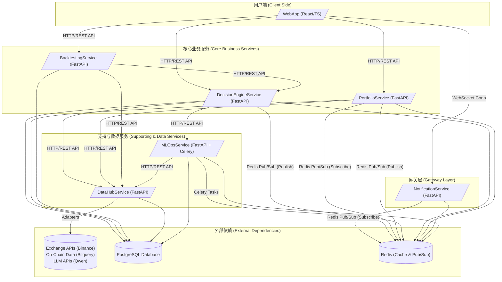

### **项目计划书：AI增强型加密货币交易决策平台 (代号：Project Bedrock)**

---

### **第一部分：项目愿景与核心原则 (The 'Why')**

#### **1.1 项目使命**

本项目旨在构建一个**AI增强的、可自我优化的全链路交易研究与决策平台**。

它不是一个简单的信号工具，也不是一个黑盒交易机器人。它的核心使命是：**将人类交易员的结构化策略与机器的强大计算分析能力相结合，通过一个透明、可回测、可持续进化的系统，赋能交易者做出更高质量、更具纪律性的决策。**

最终，平台将成为交易员的“第二大脑”，负责处理海量数据、识别复杂模式、执行严格的风险管理，并将这一切以清晰、可解释的方式呈现，让交易员能专注于更高层次的策略制定与市场洞察。

#### **1.2 核心架构原则 (项目宪法)**

以下原则是本项目的基石，所有设计、开发和决策都必须严格遵守，以避免重蹈覆辙，确保项目的长期健康。

1.  **关注点分离 (Separation of Concerns)**：每个模块、服务或组件只做一件事，并把它做好。严禁将数据库访问、业务逻辑、API路由等不同职责的代码耦合在同一个文件或函数中。

2.  **领域驱动设计 (Domain-Driven Design - DDD)**：系统将围绕核心业务领域（如`Signal`, `Position`, `Backtest`）进行建模。我们将首先定义清晰的领域对象和服务，再考虑技术实现，确保软件结构能真实反映业务需求。

3.  **接口隔离与可插拔性 (Interface Segregation & Pluggability)**：所有外部依赖（交易所、数据源、LLM模型）和内部服务都必须通过抽象接口（适配器模式）进行交互。业务逻辑代码不应知道它正在与“Binance”或“Qwen”对话，而只应知道它在与一个`ExchangeInterface`或`LLMInterface`对话。这保证了任何组件都可以被轻松替换或模拟。

4.  **依赖注入 (Dependency Injection - DI)**：严禁在业务代码内部手动创建依赖实例（如数据库连接、服务客户端）。所有依赖都必须通过框架（如FastAPI的`Depends`）从外部注入。这是实现高可测试性、高可维护性的关键。

5.  **容器优先 (Container First)**：所有服务从第一天起就必须在Docker容器中开发和运行。使用Docker Compose统一管理本地开发环境，以Kubernetes为最终生产部署目标。这消除了“在我机器上能跑”的问题，并为未来的CI/CD和弹性伸缩铺平了道路。

6.  **异步优先，边界清晰 (Async First, Clear Boundaries)**：后端服务将优先采用异步模式（`asyncio`）以获得高性能。当必须与同步代码（如某些SDK）交互时，必须在明确的服务边界上使用`anyio.to_thread`等工具进行隔离，严禁在核心业务逻辑中进行同步/异步混用。

7.  **事件驱动通信 (Event-Driven Communication)**：服务间的非阻塞性通信应优先采用事件驱动模式（如Redis Pub/Sub）。所有事件都必须有严格的、经过校验的Schema，确保生产者和消费者之间的契约清晰。

---
*（接下来的部分将根据您的指示，继续构建系统架构蓝图、开发路线图以及数据与接口契约。）*
---

### **第二部分：系统架构蓝图 (The 'How')**

#### **2.1 高阶系统架构图（文字描述）**

本系统采用基于容器的微服务架构。所有服务在逻辑上独立，物理上通过网络进行通信，共同协作完成复杂的决策流程。

**核心组件与交互流程：**



**交互流程详解：**

1.  **数据采集**：`DataHubService` 是唯一的数据入口。它通过可插拔的**适配器**定期从外部API（交易所、链上数据源）拉取数据，清洗后存入`PostgreSQL`，并可能将热数据缓存至`Redis`。

2.  **决策生成（实时）**：
    *   `DecisionEngineService` 按计划启动决策流程。它通过REST API向`DataHubService`请求所需数据。
    *   内部的**规则、ML、LLM引擎**并行分析数据。ML引擎可能需要通过REST API向`MLOpsService`请求在线推理结果。
    *   **决策仲裁模块**整合三方意见，生成最终的交易信号（`Signal`）。
    *   生成信号后，`DecisionEngineService`将一个结构化的“**SignalCreated**”事件发布到`Redis`的Pub/Sub通道。

3.  **仓位管理**：
    *   `PortfolioService` 订阅“**SignalCreated**”事件。接收到新信号后，它根据内置的**资金管理逻辑**计算头寸规模，模拟执行交易，并更新`PostgreSQL`中的仓位（`Position`）和交易（`Trade`）记录。
    *   仓位状态发生变化后，`PortfolioService`会发布一个“**PortfolioUpdated**”事件到`Redis` Pub/Sub。

4.  **实时通知**：
    *   `NotificationService` 订阅所有对前端有意义的事件，如“**SignalCreated**”和“**PortfolioUpdated**”。
    *   当接收到事件时，它会通过已建立的**WebSocket**连接，将格式化后的消息实时推送给已连接的`WebApp`客户端。

5.  **用户交互**：
    *   用户在`WebApp`上通过标准的**REST API**与后端服务交互，例如：手动触发一次回测（调用`BacktestingService`）、查看当前仓位（调用`PortfolioService`）或查看历史信号（调用`DecisionEngineService`）。
    *   同时，`WebApp`通过**WebSocket**被动接收来自`NotificationService`的实时更新，无需轮询。

6.  **回测流程**：
    *   用户通过`WebApp`向`BacktestingService`发起一个回测请求，指定策略、时间范围等参数。
    *   `BacktestingService` 从`DataHubService`拉取所需时间段的历史数据，并循环调用`DecisionEngineService`的决策逻辑来模拟历史交易，最终生成详细的回测报告。

7.  **模型训练**：
    *   `MLOpsService` 包含由`Celery`管理的后台任务。它可以定期（或手动触发）从`DataHubService`拉取大量数据，进行特征工程和模型训练。训练好的新模型版本信息将被存储在`PostgreSQL`中，并可供`DecisionEngineService`调用。

#### **2.2 技术栈选型**

为实现上述架构，我们选择一套成熟、高效且生态丰富的技术栈。

*   **后端框架**: **FastAPI (Python 3.11+)**
    *   *理由*：基于Starlette和Pydantic，提供极高的异步性能。自带数据校验、依赖注入和自动生成API文档（OpenAPI），完美契合我们的架构原则。

*   **数据库**: **PostgreSQL 16+**
    *   *理由*：功能强大、稳定可靠的开源关系型数据库。支持JSONB等复杂数据类型，能很好地存储结构化数据和半结构化的元数据。拥有强大的时序数据处理扩展（如TimescaleDB），对金融场景友好。

*   **缓存 / 消息队列**: **Redis 7+**
    *   *理由*：高性能的内存数据库。在此架构中扮演双重角色：1) 作为**缓存**，存储热点数据（如最新价格）；2) 作为**消息代理 (Broker)**，通过其Pub/Sub功能实现服务间的轻量级事件驱动通信。

*   **后台任务队列**: **Celery**
    *   *理由*：Python生态中最成熟的分布式任务队列。与Redis结合，非常适合处理耗时的后台任务，如`MLOpsService`中的模型训练、数据清洗，以及`DataHubService`中的数据采集。

*   **前端框架**: **React (with TypeScript)**
    *   *理由*：拥有庞大的社区和丰富的组件生态，是构建复杂单页应用（SPA）的事实标准。结合TypeScript可以提供类型安全，提升代码质量和可维护性。

*   **部署与容器化**: **Docker & Kubernetes (K8s)**
    *   *理由*：**Docker**用于构建标准化的服务镜像，解决环境一致性问题。**Docker Compose**用于管理本地多容器开发环境。**Kubernetes**作为生产环境的容器编排平台，提供服务发现、负载均衡、自动伸缩和故障自愈能力，是微服务架构的最佳实践。

*   **LLM 集成**: **Qwen API (或其他主流模型API)**
    *   *理由*：通过封装好的REST API调用，可以轻松集成强大的语言模型能力，用于宏观叙事分析和自然语言解释。

*   **ML 框架**: **Scikit-learn, XGBoost, PyTorch**
    *   *理由*：**Scikit-learn**用于快速实现传统机器学习模型和数据预处理。**XGBoost**在处理表格类结构化数据时表现卓越，非常适合金融预测。**PyTorch**（或TensorFlow）用于构建更复杂的深度学习模型，如LSTM，用于时间序列分析。

---
*（接下来，我们将进入计划的核心部分：功能模块与开发路线图。）*

---

### **第三部分：功能模块与开发路线图 (The 'What' & 'When')**

本路线图采用敏捷、迭代的方式，旨在每个阶段都能交付可验证的价值，并为下一阶段打下坚实基础。

#### **Phase 1: 最小可行产品 (MVP) - 建立骨架与核心规则 (预计周期: 4-6周)**

**目标**：搭建并验证整个系统的基础骨架和基于规则的核心交易流程。此阶段结束时，我们应有一个可以运行、能生成信号并管理模拟仓位的基本系统。

| 功能点 | 映射到服务 | 具体开发任务 |
| :--- | :--- | :--- |
| **1. 基础设施搭建** | **DevOps** | 1. 初始化项目仓库 (Monorepo结构)。<br>2. 编写根目录的 `docker-compose.yml`，定义所有Phase 1服务、PostgreSQL和Redis。<br>3. 为每个服务创建 `Dockerfile`。 |
| **2. 基础数据采集** | **`DataHubService`** | 1. 实现 `BinanceAdapter`，用于获取K线数据。<br>2. 创建API端点 `/klines`，供其他服务调用。<br>3. 设计并创建 `klines` 数据表。 |
| **3. 规则引擎实现** | **`DecisionEngineService`** | 1. **(市场筛选)** 实现逻辑，调用`DataHubService`筛选出符合趋势条件的市场。<br>2. **(入场/出场)** 实现**回调买入**和**三合一退出**（初始止损、跟踪止损、获利目标）的核心算法。<br>3. 创建API端点 `/generate-signal`，用于手动触发或定时任务调用。<br>4. 设计并创建 `signals` 数据表。<br>5. 实现事件发布逻辑：当信号生成时，向Redis发布 `SignalCreated` 事件。 |
| **4. 仓位与资金管理** | **`PortfolioService`** | 1. 实现事件订阅逻辑，监听 `SignalCreated` 事件。<br>2. **(资金管理)** 实现**头寸规模计算**逻辑，根据账户总额和风险系数决定交易数量。<br>3. 实现模拟交易逻辑：根据信号更新仓位。<br>4. 设计并创建 `positions` 和 `trades` 数据表。<br>5. 创建API端点 `/positions` 和 `/stats`，用于前端查询。 |
| **5. 基础前端展示** | **`WebApp`** | 1. 创建一个简单的仪表盘页面。<br>2. 调用 `/signals` 和 `/positions` API，以表格形式展示信号历史和当前仓位。<br>3. 页面布局和基础UI组件。 |

---

#### **Phase 2: 引入智能与回测 - 验证AI有效性 (预计周期: 6-8周)**

**目标**：为系统注入AI“大脑”，并提供强大的回测工具来量化评估AI策略相对于纯规则策略的提升效果。

| 功能点 | 映射到服务 | 具体开发任务 |
| :--- | :--- | :--- |
| **1. ML引擎集成** | **`DecisionEngineService`** | 1. 定义 `MLModelInterface` 适配器接口。<br>2. 实现一个简单的 `XGBoostAdapter`，加载一个预训练好的模型（此阶段可手动训练）。<br>3. 修改决策流程，在规则信号生成后，调用ML模型获取**置信度评分**。 |
| **2. LLM引擎集成** | **`DecisionEngineService`** | 1. 定义 `LLMInterface` 适配器接口。<br>2. 实现 `QwenAdapter`，调用Qwen API分析市场新闻/情绪（数据源可暂时为手动输入或简单爬虫）。<br>3. 将LLM的分析结果作为决策参考之一。 |
| **3. 决策仲裁** | **`DecisionEngineService`** | 1. 实现**决策仲裁模块**，根据预设权重（如规则引擎50%, ML引擎50%）或逻辑（如“规则通过且ML评分>70”）来决定是否最终生成信号。 |
| **4. 核心回测功能** | **`BacktestingService`** | 1. 创建服务骨架和API端点 `/backtest`。<br>2. 实现回测循环逻辑：拉取历史数据，迭代调用`DecisionEngineService`的决策API。<br>3. 实现核心绩效指标计算（夏普比率、最大回撤、盈亏比等）。<br>4. 设计并创建 `backtest_reports` 数据表。 |
| **5. 前端增强** | **`WebApp`** | 1. 创建回测页面，允许用户提交回测任务并查看报告。<br>2. 在信号展示中，加入ML置信度分和LLM情绪分析的简报。 |

---

#### **Phase 3: 迈向自动化与生产 - 完善生态系统 (预计周期: 5-7周)**

**目标**：建立模型的自我优化闭环，实现系统状态的实时推送，并完成生产化部署的准备工作。

| 功能点 | 映射到服务 | 具体开发任务 |
| :--- | :--- | :--- |
| **1. ML模型自动化** | **`MLOpsService`** | 1. 创建服务骨架，集成Celery。<br>2. 开发一个Celery任务，用于定期从`DataHubService`拉取数据，执行特征工程和模型**重训练**。<br>3. 实现模型**版本管理**和注册表功能，供`DecisionEngineService`查询和加载最新/最佳模型。 |
| **2. 实时通知网关** | **`NotificationService`** | 1. 创建服务骨架，实现WebSocket连接管理。<br>2. 订阅Redis中的 `SignalCreated` 和 `PortfolioUpdated` 等事件。<br>3. 将接收到的事件格式化后，通过WebSocket实时推送给前端。 |
| **3. 自我调优逻辑** | **`DecisionEngineService` / `MLOpsService`** | 1. **(参数优化)** 在`BacktestingService`中增加参数寻优功能（如网格搜索）。<br>2. **(权重调整)** 设计一个初步的逻辑，允许系统根据回测绩效，建议调整决策仲裁中各引擎的权重。 |
| **4. 生产化部署** | **DevOps** | 1. 为每个服务编写**Kubernetes部署文件 (YAML) 或 Helm Charts**。<br>2. 配置CI/CD流水线（如GitHub Actions），实现代码提交后自动构建Docker镜像并推送到镜像仓库。 |
| **5. 前端实时化** | **`WebApp`** | 1. 集成WebSocket客户端，监听来自`NotificationService`的消息。<br>2. 将仪表盘上的信号和仓位展示从轮询改为实时更新。 |

---

#### **Phase 4: 扩展与生态 - 增强平台能力 (持续进行)**

**目标**：在稳固的平台上不断扩展功能边界，提升平台的深度和广度。

| 功能点 | 映射到服务 | 具体开发任务 |
| :--- | :--- | :--- |
| **1. 扩展数据源** | **`DataHubService`** | 1. **(链上数据)** 实现 `BitqueryAdapter`，获取链上大额转账、聪明钱动向等数据。<br>2. **(多交易所)** 实现 `BybitAdapter` 或其他交易所适配器，拓宽交易市场范围。<br>3. 将新数据源整合进`DecisionEngineService`的决策流程中。 |
| **2. 高级可视化** | **`WebApp`** | 1. 引入图表库（如ECharts, D3.js），开发交互式的**净值曲线**图、**绩效分析**雷达图等。<br>2. 在回测报告中提供更详细的交易明细和统计分布图。 |
| **3. 深度LLM应用** | **`DecisionEngineService` / `WebApp`** | 1. 利用LLM为每一笔交易自动生成**自然语言的交易日志**或**复盘备忘录**。<br>2. 探索使用LLM进行更复杂的**基本面分析**（如解析项目白皮书更新）。 |
| **4. 平台健壮性** | **All Services** | 1. 完善单元测试和集成测试，提升代码覆盖率。<br>2. 引入监控和告警系统（如Prometheus, Grafana）。<br>3. 持续的性能优化和安全加固。 |

---
*（最后，我们将定义关键的数据模型和接口契约，为开发提供精确的蓝图。）*
---

### **第四部分：数据模型与接口契约 (The 'Language')**

#### **4.1 核心领域对象数据模型 (Database Schema)**

###### **4.1.1 Signal (交易信号)**

| 字段名 | 类型 | 说明 | 示例 |
|--------|------|------|------|
| `id` | UUID | 主键 | `550e8400-e29b-41d4-a716-446655440000` |
| `market` | VARCHAR(50) | 交易品种 | `BTC/USDT` |
| `signal_type` | ENUM | 信号类型：`PULLBACK_BUY`, `OOPS_BUY`, `OOPS_SELL` | `PULLBACK_BUY` |
| `entry_price` | DECIMAL(18, 8) | 建议入场价格 | `65000.50000000` |
| `stop_loss_price` | DECIMAL(18, 8) | 初始止损价格 | `63500.00000000` |
| `profit_target_price` | DECIMAL(18, 8) | 获利目标价格 | `68000.00000000` |
| `risk_unit_r` | DECIMAL(18, 8) | 单个风险单位 (R) | `1500.00000000` |
| `created_at` | TIMESTAMP | 信号生成时间 | `2024-11-08T14:30:00Z` |
| `rule_engine_score` | FLOAT | 规则引擎置信度 (0-100) | `85.5` |
| `ml_confidence_score` | FLOAT | ML模型置信度 (0-100，初始为NULL) | `78.3` |
| `llm_sentiment` | VARCHAR(20) | LLM情绪分析结果 | `POSITIVE`, `NEGATIVE`, `NEUTRAL` |
| `final_decision` | ENUM | 最终决策 | `APPROVED`, `REJECTED` |
| `explanation` | TEXT | 由LLM生成的决策解释 (可选) | `"本次买入基于..."` |

---

###### **4.1.2 Position (仓位)**

| 字段名 | 类型 | 说明 | 示例 |
|--------|------|------|------|
| `id` | UUID | 主键 | `660e8400-e29b-41d4-a716-446655441111` |
| `market` | VARCHAR(50) | 交易品种 | `BTC/USDT` |
| `signal_id` | UUID | 关联信号ID（外键） | `550e8400-e29b-41d4-a716-446655440000` |
| `position_size` | DECIMAL(18, 8) | 头寸数量（合约数或币量） | `3.0` |
| `entry_price` | DECIMAL(18, 8) | 实际入场价格 | `65000.50000000` |
| `current_price` | DECIMAL(18, 8) | 当前市价（实时更新或缓存） | `65500.00000000` |
| `stop_loss_price` | DECIMAL(18, 8) | 当前止损价格（可能随跟踪止损更新） | `63500.00000000` |
| `profit_target_price` | DECIMAL(18, 8) | 目标价格 | `68000.00000000` |
| `status` | ENUM | 仓位状态 | `OPEN`, `CLOSED`, `PENDING` |
| `unrealized_pnl` | DECIMAL(18, 8) | 未实现盈亏 | `1500.00` |
| `created_at` | TIMESTAMP | 仓位开仓时间 | `2024-11-08T14:35:00Z` |
| `closed_at` | TIMESTAMP | 仓位平仓时间（可选） | `2024-11-08T16:00:00Z` |
| `exit_reason` | ENUM | 平仓原因 | `PROFIT_TARGET_HIT`, `STOP_LOSS_HIT`, `TRAILING_STOP_HIT`, `MANUAL_CLOSE` |

---

###### **4.1.3 Trade (交易记录)**

| 字段名 | 类型 | 说明 | 示例 |
|--------|------|------|------|
| `id` | UUID | 主键 | `770e8400-e29b-41d4-a716-446655442222` |
| `position_id` | UUID | 关联仓位ID（外键） | `660e8400-e29b-41d4-a716-446655441111` |
| `trade_type` | ENUM | 交易类型 | `ENTRY`, `EXIT` |
| `market` | VARCHAR(50) | 交易品种 | `BTC/USDT` |
| `quantity` | DECIMAL(18, 8) | 成交数量 | `3.0` |
| `price` | DECIMAL(18, 8) | 成交价格 | `65000.50000000` |
| `timestamp` | TIMESTAMP | 成交时间 | `2024-11-08T14:35:00Z` |
| `commission` | DECIMAL(18, 8) | 手续费 | `10.00` |
| `realized_pnl` | DECIMAL(18, 8) | 已实现盈亏（仅EXIT）| `1490.00` |

---

###### **4.1.4 BacktestReport (回测报告)**

| 字段名 | 类型 | 说明 | 示例 |
|--------|------|------|------|
| `id` | UUID | 主键 | `880e8400-e29b-41d4-a716-446655443333` |
| `strategy_name` | VARCHAR(100) | 策略名称 | `Rules Only`, `Rules + ML` |
| `start_date` | DATE | 回测开始日期 | `2024-01-01` |
| `end_date` | DATE | 回测结束日期 | `2024-10-31` |
| `initial_balance` | DECIMAL(18, 2) | 初始账户余额 | `100000.00` |
| `final_balance` | DECIMAL(18, 2) | 最终账户余额 | `125000.00` |
| `total_trades` | INT | 总交易数 | `45` |
| `winning_trades` | INT | 获利交易数 | `25` |
| `losing_trades` | INT | 亏损交易数 | `20` |
| `win_rate` | FLOAT | 胜率 (%) | `55.56` |
| `avg_win` | DECIMAL(18, 2) | 平均获利 | `1500.00` |
| `avg_loss` | DECIMAL(18, 2) | 平均亏损 | `800.00` |
| `profit_factor` | FLOAT | 盈利因子（总获利/总亏损） | `2.34` |
| `max_drawdown` | FLOAT | 最大回撤 (%) | `12.50` |
| `sharpe_ratio` | FLOAT | 夏普比率 | `1.45` |
| `roi` | FLOAT | 投资回报率 (%) | `25.00` |
| `created_at` | TIMESTAMP | 报告生成时间 | `2024-11-08T10:00:00Z` |

---

###### **4.1.5 MLModel (机器学习模型元数据)**

| 字段名 | 类型 | 说明 | 示例 |
|--------|------|------|------|
| `id` | UUID | 主键 | `990e8400-e29b-41d4-a716-446655444444` |
| `model_name` | VARCHAR(100) | 模型名称 | `xgboost_signal_confidence` |
| `version` | VARCHAR(20) | 版本号 | `1.2.3` |
| `model_type` | ENUM | 模型类型 | `XGBOOST`, `LSTM`, `RANDOM_FOREST` |
| `artifact_path` | VARCHAR(255) | 模型文件存储路径 | `s3://bucket/models/xgboost_1.2.3.pkl` |
| `features` | JSONB | 模型使用的特征列表 | `["rsi", "macd", "volume", "whale_activity"]` |
| `training_date` | TIMESTAMP | 训练时间 | `2024-11-08T08:00:00Z` |
| `training_accuracy` | FLOAT | 训练准确率 | `0.82` |
| `validation_accuracy` | FLOAT | 验证准确率 | `0.78` |
| `is_active` | BOOLEAN | 是否为当前生产模型 | `true` |
| `metadata` | JSONB | 其他元数据（超参数等） | `{"max_depth": 8, "learning_rate": 0.1}` |

---

#### **4.2 服务间事件契约 (Event Contracts)**

所有事件通过Redis Pub/Sub发送，采用标准JSON格式。事件必须包含 `event_type` 和 `timestamp`。

###### **4.2.1 SignalCreated (信号已生成)**

**发布方**: `DecisionEngineService`  
**订阅方**: `PortfolioService`, `NotificationService`

```json
{
  "event_type": "signal.created",
  "timestamp": "2024-11-08T14:30:00Z",
  "signal_id": "550e8400-e29b-41d4-a716-446655440000",
  "market": "BTC/USDT",
  "signal_type": "PULLBACK_BUY",
  "entry_price": 65000.50,
  "stop_loss_price": 63500.00,
  "profit_target_price": 68000.00,
  "risk_unit_r": 1500.00,
  "rule_engine_score": 85.5,
  "ml_confidence_score": 78.3,
  "llm_sentiment": "POSITIVE",
  "final_decision": "APPROVED",
  "explanation": "基于规则和ML模型的综合分析，该信号具有较高的胜率潜力。"
}
```

---

###### **4.2.2 PortfolioUpdated (仓位已更新)**

**发布方**: `PortfolioService`  
**订阅方**: `NotificationService`

```json
{
  "event_type": "portfolio.updated",
  "timestamp": "2024-11-08T14:35:00Z",
  "position_id": "660e8400-e29b-41d4-a716-446655441111",
  "market": "BTC/USDT",
  "action": "POSITION_OPENED",
  "position_size": 3.0,
  "entry_price": 65000.50,
  "current_price": 65500.00,
  "unrealized_pnl": 1500.00,
  "status": "OPEN"
}
```

---

###### **4.2.3 PositionClosed (仓位已平仓)**

**发布方**: `PortfolioService`  
**订阅方**: `NotificationService`

```json
{
  "event_type": "position.closed",
  "timestamp": "2024-11-08T16:00:00Z",
  "position_id": "660e8400-e29b-41d4-a716-446655441111",
  "market": "BTC/USDT",
  "exit_price": 68000.00,
  "exit_reason": "PROFIT_TARGET_HIT",
  "realized_pnl": 7500.00,
  "roi": "7.5%"
}
```

---

###### **4.2.4 ModelTrained (模型训练完成)**

**发布方**: `MLOpsService`  
**订阅方**: `DecisionEngineService`

```json
{
  "event_type": "model.trained",
  "timestamp": "2024-11-08T18:00:00Z",
  "model_name": "xgboost_signal_confidence",
  "version": "1.2.4",
  "validation_accuracy": 0.79,
  "is_better_than_previous": true,
  "artifact_path": "s3://bucket/models/xgboost_1.2.4.pkl"
}
```

---

#### **4.3 核心API契约 (API Contracts)**

###### **4.3.1 DecisionEngineService**

| 端点 | 方法 | 说明 | 请求体/参数 | 返回值 |
|------|------|------|-----------|--------|
| `/signals/generate` | POST | 生成交易信号 | `{ "market": "BTC/USDT", "force_analysis": false }` | 返回`Signal`对象 |
| `/signals/list` | GET | 列出历史信号 | `?market=BTC/USDT&limit=10&offset=0` | 返回信号列表 + 分页信息 |
| `/signals/{signal_id}` | GET | 查询单个信号详情 | — | 返回`Signal`对象 |

---

###### **4.3.2 PortfolioService**

| 端点 | 方法 | 说明 | 请求体/参数 | 返回值 |
|------|------|------|-----------|--------|
| `/positions` | GET | 查询当前仓位 | `?market=BTC/USDT&status=OPEN` | 返回仓位列表 |
| `/positions/{position_id}` | GET | 查询单个仓位详情 | — | 返回`Position`对象 |
| `/trades` | GET | 查询交易历史 | `?limit=20&offset=0` | 返回交易记录列表 |
| `/stats` | GET | 查询账户统计数据 | — | 返回`{ total_pnl, win_rate, avg_trade_duration, ... }` |

---

###### **4.3.3 BacktestingService**

| 端点 | 方法 | 说明 | 请求体/参数 | 返回值 |
|------|------|------|-----------|--------|
| `/backtest/submit` | POST | 提交回测任务 | `{ "strategy": "rules_only", "start_date": "2024-01-01", "end_date": "2024-10-31", "initial_balance": 100000 }` | 返回`{ task_id, status }` |
| `/backtest/status/{task_id}` | GET | 查询回测任务状态 | — | 返回`{ task_id, status, progress }` |
| `/backtest/report/{task_id}` | GET | 获取回测报告 | — | 返回`BacktestReport`对象 |

---

###### **4.3.4 DataHubService**

| 端点 | 方法 | 说明 | 请求体/参数 | 返回值 |
|------|------|------|-----------|--------|
| `/klines` | GET | 获取K线数据 | `?market=BTC/USDT&interval=1h&limit=500` | 返回K线数据数组 |
| `/markets` | GET | 列出支持的市场 | — | 返回市场列表 |

---

###### **4.3.5 MLOpsService**

| 端点 | 方法 | 说明 | 请求体/参数 | 返回值 |
|------|------|------|-----------|--------|
| `/models/list` | GET | 列出所有模型版本 | `?model_name=xgboost_signal_confidence` | 返回模型列表 |
| `/models/{model_name}/predict` | POST | 调用模型进行推理 | `{ "features": {...} }` | 返回预测结果 |
| `/training/submit` | POST | 提交模型训练任务 | `{ "model_name": "xgboost_signal_confidence", "data_start_date": "2024-01-01" }` | 返回`{ task_id, status }` |

---

#### **4.4 关键设计考量**

1. **事件Schema版本控制**：所有事件均应包含 `schema_version` 字段，便于未来的向前/向后兼容性管理。
2. **错误响应标准化**：所有API错误统一返回格式 `{ "error_code": "...", "message": "...", "timestamp": "..." }`。
3. **认证与授权**：暂时不在MVP中实现，但架构应为其预留位置（如JWT token验证）。
4. **API分页**：所有返回列表的端点均应支持 `limit` 和 `offset` 参数。
5. **缓存策略**：热点数据（如最新K线）应在Redis中缓存，缓存失效时间由服务自身管理。

---

这部分可以直接保存为 `docs/DATA_MODEL_AND_API_CONTRACT.md`，供开发团队参考。