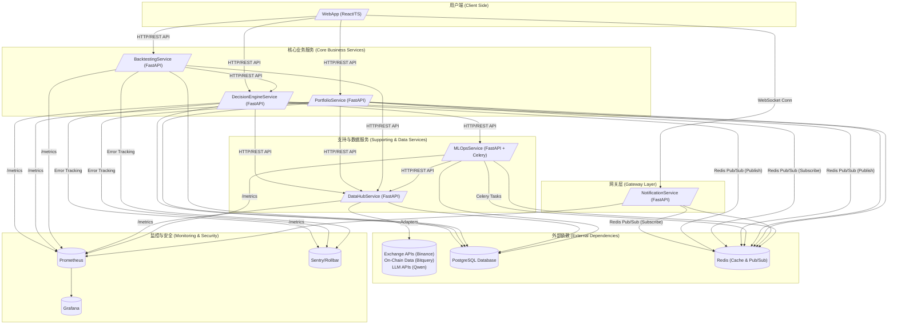

### **项目计划书 v2.0：AI增强型加密货币交易决策平台 (代号：Project Bedrock)**

**版本说明**：本文档是基于 `1.md` 的增强版本，整合了所有优化任务和方案A（suggested_position_weight）的完整实现细节。

---

### **第一部分：项目愿景与核心原则 (The 'Why')**

#### **1.1 项目使命**

本项目旨在构建一个**AI增强的、可自我优化的全链路交易研究与决策平台**。

它不是一个简单的信号工具,也不是一个黑盒交易机器人。它的核心使命是：**将人类交易员的结构化策略与机器的强大计算分析能力相结合，通过一个透明、可回测、可持续进化的系统，赋能交易者做出更高质量、更具纪律性的决策。**

最终，平台将成为交易员的"第二大脑"，负责处理海量数据、识别复杂模式、执行严格的风险管理，并将这一切以清晰、可解释的方式呈现，让交易员能专注于更高层次的策略制定与市场洞察。

#### **1.2 核心架构原则 (项目宪法)**

以下原则是本项目的基石，所有设计、开发和决策都必须严格遵守，以避免重蹈覆辙，确保项目的长期健康。

1.  **关注点分离 (Separation of Concerns)**：每个模块、服务或组件只做一件事，并把它做好。严禁将数据库访问、业务逻辑、API路由等不同职责的代码耦合在同一个文件或函数中。

2.  **领域驱动设计 (Domain-Driven Design - DDD)**：系统将围绕核心业务领域（如`Signal`, `Position`, `Backtest`）进行建模。我们将首先定义清晰的领域对象和服务，再考虑技术实现，确保软件结构能真实反映业务需求。

3.  **接口隔离与可插拔性 (Interface Segregation & Pluggability)**：所有外部依赖（交易所、数据源、LLM模型）和内部服务都必须通过抽象接口（适配器模式）进行交互。业务逻辑代码不应知道它正在与"Binance"或"Qwen"对话，而只应知道它在与一个`ExchangeInterface`或`LLMInterface`对话。这保证了任何组件都可以被轻松替换或模拟。

4.  **依赖注入 (Dependency Injection - DI)**：严禁在业务代码内部手动创建依赖实例（如数据库连接、服务客户端）。所有依赖都必须通过框架（如FastAPI的`Depends`）从外部注入。这是实现高可测试性、高可维护性的关键。

5.  **容器优先 (Container First)**：所有服务从第一天起就必须在Docker容器中开发和运行。使用Docker Compose统一管理本地开发环境，以Kubernetes为最终生产部署目标。这消除了"在我机器上能跑"的问题，并为未来的CI/CD和弹性伸缩铺平了道路。

6.  **异步优先，边界清晰 (Async First, Clear Boundaries)**：后端服务将优先采用异步模式（`asyncio`）以获得高性能。当必须与同步代码（如某些SDK）交互时，必须在明确的服务边界上使用`anyio.to_thread`等工具进行隔离，严禁在核心业务逻辑中进行同步/异步混用。

7.  **事件驱动通信 (Event-Driven Communication)**：服务间的非阻塞性通信应优先采用事件驱动模式（如Redis Pub/Sub）。所有事件都必须有严格的、经过校验的Schema，确保生产者和消费者之间的契约清晰。

8.  **代码质量优先 (Code Quality First)** ⭐ **新增**：所有代码必须通过自动化质量检查（black, isort, mypy, flake8, ESLint, Prettier）。使用 pre-commit hooks 确保代码提交前符合规范。目标：单元测试覆盖率 >80%。

9.  **健壮性与可观测性 (Robustness & Observability)** ⭐ **新增**：所有服务必须实现健康检查端点（/health, /ready）、全局异常处理、结构化日志、监控指标（Prometheus）。确保系统在生产环境中可监控、可追踪、可恢复。

10. **安全优先 (Security First)** ⭐ **新增**：所有 API 必须实现认证（JWT）和授权（RBAC）。敏感数据必须加密存储。定期进行依赖漏洞扫描。实施数据备份和灾难恢复计划。

---

### **第二部分：系统架构蓝图 (The 'How')**

#### **2.1 高阶系统架构图（文字描述）**

本系统采用基于容器的微服务架构。所有服务在逻辑上独立，物理上通过网络进行通信，共同协作完成复杂的决策流程。

**核心组件与交互流程：**



**交互流程详解：**

1.  **数据采集**：`DataHubService` 是唯一的数据入口。它通过可插拔的**适配器**定期从外部API（交易所、链上数据源）拉取数据，清洗后存入`PostgreSQL`，并将热数据缓存至`Redis`。⭐ **增强**：实现速率限制、API 重试机制、数据持久化。

2.  **决策生成（实时）**：
    *   `DecisionEngineService` 按计划启动决策流程。它通过REST API向`DataHubService`请求所需数据。
    *   内部的**规则、ML、LLM引擎**并行分析数据。ML引擎可能需要通过REST API向`MLOpsService`请求在线推理结果。
    *   **决策仲裁模块**整合三方意见，生成最终的交易信号（`Signal`）。⭐ **新增**：信号包含 `suggested_position_weight` 字段（方案A）。
    *   生成信号后，`DecisionEngineService`将一个结构化的"**SignalCreated**"事件发布到`Redis`的Pub/Sub通道。⭐ **增强**：实现事件发布失败重试机制。

3.  **仓位管理**：
    *   `PortfolioService` 订阅"**SignalCreated**"事件。接收到新信号后，它根据内置的**资金管理逻辑**计算头寸规模。⭐ **新增**：优先使用信号的 `suggested_position_weight`，如果没有则使用默认固定风险算法（方案A）。
    *   模拟执行交易，并更新`PostgreSQL`中的仓位（`Position`）和交易（`Trade`）记录。⭐ **新增**：记录 `position_weight_used` 字段。
    *   仓位状态发生变化后，`PortfolioService`会发布一个"**PortfolioUpdated**"事件到`Redis` Pub/Sub。⭐ **增强**：实现事件订阅错误恢复机制。

4.  **实时通知**：
    *   `NotificationService` 订阅所有对前端有意义的事件，如"**SignalCreated**"和"**PortfolioUpdated**"。
    *   当接收到事件时，它会通过已建立的**WebSocket**连接，将格式化后的消息实时推送给已连接的`WebApp`客户端。⭐ **增强**：实现连接状态管理和自动重连机制。

5.  **用户交互**：
    *   用户在`WebApp`上通过标准的**REST API**与后端服务交互，例如：手动触发一次回测（调用`BacktestingService`）、查看当前仓位（调用`PortfolioService`）或查看历史信号（调用`DecisionEngineService`）。
    *   同时，`WebApp`通过**WebSocket**被动接收来自`NotificationService`的实时更新，无需轮询。⭐ **新增**：前端显示 `suggested_position_weight` 和调用 `/positions/estimate` 预估接口（方案A）。

6.  **回测流程**：
    *   用户通过`WebApp`向`BacktestingService`发起一个回测请求，指定策略、时间范围等参数。
    *   `BacktestingService` 从`DataHubService`拉取所需时间段的历史数据，并循环调用`DecisionEngineService`的决策逻辑来模拟历史交易，最终生成详细的回测报告。⭐ **增强**：实现滑点和手续费模拟，计算高级绩效指标（卡尔玛比率、索提诺比率）。

7.  **模型训练**：
    *   `MLOpsService` 包含由`Celery`管理的后台任务。它可以定期（或手动触发）从`DataHubService`拉取大量数据，进行特征工程和模型训练。训练好的新模型版本信息将被存储在`PostgreSQL`中，并可供`DecisionEngineService`调用。⭐ **增强**：实现训练数据版本管理、超参数调优（Optuna）、模型 A/B 测试。

8.  **监控与告警** ⭐ **新增**：
    *   所有服务暴露 `/metrics` 端点，`Prometheus` 定期抓取指标。
    *   `Grafana` 可视化监控数据，配置告警规则（服务不可用、高错误率、低胜率等）。
    *   `Sentry/Rollbar` 聚合错误日志，实时追踪异常。

---

#### **2.2 技术栈选型**

为实现上述架构，我们选择一套成熟、高效且生态丰富的技术栈。

*   **后端框架**: **FastAPI (Python 3.11+)**
    *   *理由*：基于Starlette和Pydantic，提供极高的异步性能。自带数据校验、依赖注入和自动生成API文档（OpenAPI），完美契合我们的架构原则。

*   **数据库**: **PostgreSQL 16+**
    *   *理由*：功能强大、稳定可靠的开源关系型数据库。支持JSONB等复杂数据类型，能很好地存储结构化数据和半结构化的元数据。拥有强大的时序数据处理扩展（如TimescaleDB），对金融场景友好。

*   **缓存 / 消息队列**: **Redis 7+**
    *   *理由*：高性能的内存数据库。在此架构中扮演双重角色：1) 作为**缓存**，存储热点数据（如最新价格）；2) 作为**消息代理 (Broker)**，通过其Pub/Sub功能实现服务间的轻量级事件驱动通信。

*   **后台任务队列**: **Celery**
    *   *理由*：Python生态中最成熟的分布式任务队列。与Redis结合，非常适合处理耗时的后台任务，如`MLOpsService`中的模型训练、数据清洗，以及`DataHubService`中的数据采集。

*   **前端框架**: **React (with TypeScript) + Vite**
    *   *理由*：拥有庞大的社区和丰富的组件生态，是构建复杂单页应用（SPA）的事实标准。结合TypeScript可以提供类型安全，提升代码质量和可维护性。Vite 提供极速的开发体验。

*   **UI 组件库**: **Ant Design (antd)**
    *   *理由*：企业级 UI 设计语言，提供丰富的高质量 React 组件，适合快速构建专业的管理后台。

*   **可视化库**: **ECharts / Recharts**
    *   *理由*：ECharts 功能强大，适合复杂的交互式图表（净值曲线、雷达图、热力图）。Recharts 轻量级，适合简单图表。

*   **部署与容器化**: **Docker & Kubernetes (K8s)**
    *   *理由*：**Docker**用于构建标准化的服务镜像，解决环境一致性问题。**Docker Compose**用于管理本地多容器开发环境。**Kubernetes**作为生产环境的容器编排平台，提供服务发现、负载均衡、自动伸缩和故障自愈能力，是微服务架构的最佳实践。

*   **LLM 集成**: **Qwen API (通义千问) via dashscope SDK**
    *   *理由*：通过封装好的 SDK 调用，可以轻松集成强大的语言模型能力，用于宏观叙事分析和自然语言解释。

*   **交易所集成**: **Binance API via python-binance 库**
    *   *理由*：python-binance 是成熟的 Binance API 封装库，提供异步支持，简化 API 调用。

*   **ML 框架**: **Scikit-learn, XGBoost, PyTorch**
    *   *理由*：**Scikit-learn**用于快速实现传统机器学习模型和数据预处理。**XGBoost**在处理表格类结构化数据时表现卓越，非常适合金融预测。**PyTorch**（或TensorFlow）用于构建更复杂的深度学习模型，如LSTM，用于时间序列分析。

*   **模型管理**: **MLflow**
    *   *理由*：开源的 MLOps 平台，提供模型版本管理、实验追踪、模型注册表功能。

*   **超参数调优**: **Optuna** ⭐ **新增**
    *   *理由*：高效的超参数优化框架，支持贝叶斯优化、剪枝等高级功能。

*   **监控与告警**: **Prometheus + Grafana** ⭐ **新增**
    *   *理由*：Prometheus 是云原生监控标准，Grafana 提供强大的可视化和告警功能。

*   **错误追踪**: **Sentry / Rollbar** ⭐ **新增**
    *   *理由*：实时错误追踪和聚合，帮助快速定位和修复问题。

*   **代码质量工具**: ⭐ **新增**
    *   **Python**: black (格式化), isort (导入排序), mypy (类型检查), flake8 (代码检查)
    *   **JavaScript/TypeScript**: ESLint, Prettier
    *   **Pre-commit**: 自动化代码质量检查

*   **数据验证**: ⭐ **新增**
    *   **后端**: Pydantic (FastAPI 内置)
    *   **前端**: zod

*   **重试机制**: **tenacity** ⭐ **新增**
    *   *理由*：优雅的 Python 重试库，支持指数退避、条件重试等策略。

*   **结构化日志**: **structlog** ⭐ **新增**
    *   *理由*：提供结构化日志输出（JSON 格式），便于日志聚合和分析。

*   **认证**: **python-jose (JWT)** ⭐ **新增**
    *   *理由*：实现 JWT 认证和授权。

*   **安全扫描**: **safety, bandit** ⭐ **新增**
    *   *理由*：safety 扫描依赖漏洞，bandit 扫描代码安全问题。

---

### **第三部分：功能模块与开发路线图 (The 'What' & 'When')**

本路线图采用敏捷、迭代的方式，旨在每个阶段都能交付可验证的价值，并为下一阶段打下坚实基础。

#### **Phase 0: 环境准备与项目初始化 (预计周期: 1-2周)** ⭐ **新增阶段**

**目标**：建立标准化的开发环境，配置代码质量工具，确保所有开发者在统一的环境中工作。

| 功能点 | 具体开发任务 |
| :--- | :--- |
| **1. 环境验证** | 1. 验证 Docker Desktop、Python 3.11+、Node.js 18+、Git 安装。<br>2. 创建 Python 虚拟环境（.venv）。<br>3. 安装全局依赖管理工具（poetry 或 pipenv）。 |
| **2. 项目初始化** | 1. 初始化 Git 仓库，创建 .gitignore。<br>2. 创建项目目录结构（services/, docs/, webapp/, scripts/）。<br>3. 创建环境变量模板文件（.env.example）。<br>4. 创建实际环境变量文件（.env）。 |
| **3. 基础设施** | 1. 创建根目录 docker-compose.yml，定义 PostgreSQL 和 Redis。<br>2. ⭐ **配置 healthcheck**：为 PostgreSQL 和 Redis 添加健康检查配置。<br>3. 启动基础设施服务并验证连接。 |
| **4. 代码质量工具** | 1. 配置 pyproject.toml（black, isort, mypy, flake8）。<br>2. 配置前端 .eslintrc.json 和 .prettierrc。<br>3. 创建 .editorconfig。<br>4. 安装和配置 pre-commit hooks。<br>5. 测试 pre-commit 自动运行。 |
| **5. 文档** | 1. 创建 README.md（项目简介、快速开始）。<br>2. 创建 ARCHITECTURE.md（系统架构）。<br>3. 创建 DATA_MODEL_AND_API_CONTRACT.md（数据模型和 API 契约）。<br>4. 创建 DEVELOPER_GUIDE.md（开发者指南）。<br>5. ⭐ **创建 ENVIRONMENT_VARIABLES.md**（环境变量命名规范和完整列表）。<br>6. ⭐ **创建 TECH_STACK_VERSIONS.md**（技术栈版本锁定）。<br>7. ⭐ **创建 DEPLOYMENT_ENVIRONMENTS.md**（环境配置对比和切换指南）。<br>8. ⭐ **创建 DATABASE_MIGRATION_GUIDE.md**（数据库迁移最佳实践和回滚流程）。<br>9. 🔹 **配置 API 文档自动生成**（ReDoc 端点、OpenAPI 文档生成）。 |
| **6. 辅助脚本** | 1. 创建 init_db.py（初始化数据库）。<br>2. 创建 init_account.py（初始化账户余额）。<br>3. 创建 test_all.sh（运行所有测试）。<br>4. 创建 lint.sh（代码质量检查）。<br>5. ⭐ **创建 validate_env.py**（环境变量验证脚本）。<br>6. 🔹 **优化开发环境热重载**（watchfiles、.dockerignore）。<br>7. 🔹 **创建数据库种子数据脚本**（seed_data.py）。 |
| **7. 首次提交** | 1. 执行 git add . 和 git commit。<br>2. 创建 .github/workflows/ 目录为 CI/CD 做准备。 |
| **8. 性能监控** | 1. 🔹 **配置 PostgreSQL 慢查询日志和性能监控**（pg_stat_statements、Grafana 面板）。 |

**关键交付物**：
- ✅ 标准化的开发环境
- ✅ 自动化代码质量检查
- ✅ 完整的项目文档框架（包括环境变量规范、版本锁定、环境对比、迁移指南）
- ✅ 可运行的基础设施（PostgreSQL + Redis）
- ✅ 环境变量验证脚本
- 🔹 API 文档自动生成（低优先级）
- 🔹 开发环境热重载优化（低优先级）
- 🔹 数据库种子数据脚本（低优先级）
- 🔹 数据库性能监控（低优先级）

---

#### **Phase 1: 最小可行产品 (MVP) - 建立骨架与核心规则 (预计周期: 4-6周)**

**目标**：搭建并验证整个系统的基础骨架和基于规则的核心交易流程。此阶段结束时，我们应有一个可以运行、能生成信号并管理模拟仓位的基本系统。

| 功能点 | 映射到服务 | 具体开发任务 | ⭐ 优化增强 |
| :--- | :--- | :--- | :--- |
| **1. 基础数据采集** | **`DataHubService`** | 1. 实现 `BinanceAdapter`，用于获取K线数据。<br>2. 创建API端点 `/klines`，供其他服务调用。<br>3. 设计并创建 `klines` 数据表。<br>4. 初始化 Alembic 数据库迁移。<br>5. ⭐ **执行数据库迁移**：运行 `alembic upgrade head` 创建表。<br>6. ⭐ **配置数据库连接池**：设置 pool_size, max_overflow, pool_pre_ping, pool_recycle。<br>7. ⭐ **配置 Redis 连接池**：使用 redis.asyncio.ConnectionPool。<br>8. ⭐ **配置 docker-compose healthcheck**：添加服务健康检查和 depends_on 条件。<br>9. 编写单元测试和集成测试。 | ⭐ **速率限制和重试**：实现 API 速率限制检测和指数退避重试（tenacity）。<br>⭐ **数据缓存**：使用 Redis 缓存 K线数据（1-5分钟过期）。<br>⭐ **参数验证**：使用 Pydantic 校验 symbol, interval, limit。<br>⭐ **数据持久化**：将 K线数据保存到 PostgreSQL（upsert 逻辑）。<br>⭐ **健康检查**：实现 /health 和 /ready 端点。<br>⭐ **全局异常处理**：统一错误响应格式。<br>⭐ **数据库索引**：添加 (symbol, interval, open_time) 复合索引。 |
| **2. 规则引擎实现** | **`DecisionEngineService`** | 1. **(市场筛选)** 实现逻辑，调用`DataHubService`筛选出符合趋势条件的市场。<br>2. **(入场/出场)** 实现**回调买入**和**三合一退出**（初始止损、跟踪止损、获利目标）的核心算法。<br>3. 创建API端点 `/signals/generate`, `/signals/list`, `/signals/{id}`。<br>4. 设计并创建 `signals` 数据表。<br>5. ⭐ **执行数据库迁移**：运行 `alembic upgrade head` 创建表。<br>6. ⭐ **配置数据库连接池**：设置 pool_size, max_overflow, pool_pre_ping, pool_recycle。<br>7. ⭐ **配置 Redis 连接池**：使用 redis.asyncio.ConnectionPool。<br>8. 实现事件发布逻辑：当信号生成时，向Redis发布 `SignalCreated` 事件。<br>9. ⭐ **配置 docker-compose healthcheck 和 depends_on**：确保依赖服务就绪后再启动。 | ⭐ **方案A - suggested_position_weight**：在 Signal 模型添加 `suggested_position_weight` 字段（DECIMAL(5,4)）。在回调买入策略中根据信号强度计算权重（高置信度 0.8-1.0，中等 0.5-0.7，低 0.3-0.5）。<br>⭐ **异常处理**：DataHubService 不可用时使用降级策略。<br>⭐ **事件重试**：EventPublisher 失败时重试，失败后保存到 failed_events 表。<br>⭐ **定时任务**：使用 APScheduler 定期触发信号生成。<br>⭐ **健康检查**：检查数据库、Redis、DataHubService 可用性。<br>⭐ **响应缓存**：GET /signals/list 使用 Redis 缓存（5分钟）。<br>⭐ **数据库索引**：添加 market, created_at, final_decision 索引。 |
| **3. 仓位与资金管理** | **`PortfolioService`** | 1. 实现事件订阅逻辑，监听 `SignalCreated` 事件。<br>2. **(资金管理)** 实现**头寸规模计算**逻辑，根据账户总额和风险系数决定交易数量。<br>3. 实现模拟交易逻辑：根据信号更新仓位。<br>4. 设计并创建 `positions`, `trades`, `account` 数据表。<br>5. ⭐ **执行数据库迁移**：运行 `alembic upgrade head` 创建表。<br>6. ⭐ **配置数据库连接池**：设置 pool_size, max_overflow, pool_pre_ping, pool_recycle。<br>7. ⭐ **配置 Redis 连接池**：使用 redis.asyncio.ConnectionPool。<br>8. 创建API端点 `/positions`, `/positions/{id}`, `/trades`, `/stats`。<br>9. ⭐ **配置 docker-compose healthcheck 和 depends_on**：确保依赖服务就绪后再启动。 | ⭐ **方案A - position_weight_used**：在 Position 模型添加 `position_weight_used` 字段。在 PositionSizer 中优先使用信号的 `suggested_position_weight`，如果没有则使用默认固定风险算法。<br>⭐ **方案A - /positions/estimate**：添加 GET /positions/estimate 端点，接收 signal_id，返回预估仓位大小、成本、风险百分比。<br>⭐ **事件订阅错误恢复**：处理失败时保存到 failed_signal_events 表，后台任务重试。<br>⭐ **账户余额管理**：创建 Account 模型，实现余额冻结和释放逻辑。<br>⭐ **健康检查**：检查数据库、Redis、EventSubscriber 运行状态。<br>⭐ **响应缓存**：GET /positions 使用 Redis 缓存（30秒）。<br>⭐ **数据库索引**：添加 market, status, created_at, signal_id 索引。 |
| **4. 基础前端展示** | **`WebApp`** | 1. 使用 Vite 初始化 React + TypeScript 项目。<br>2. 安装依赖：react-router-dom, axios, @tanstack/react-query, antd, recharts。<br>3. 创建 API 服务层（signalService, portfolioService）。<br>4. 创建信号列表组件（SignalList）。<br>5. 创建仓位列表组件（PositionList）。<br>6. 创建仪表盘页面（Dashboard）。<br>7. 配置路由。 | ⭐ **方案A - 前端显示**：在 SignalList 显示 `suggested_position_weight`（进度条或百分比）。在 PositionList 调用 /positions/estimate 显示预估信息。<br>⭐ **环境变量**：创建 .env.development 和 .env.production。<br>⭐ **错误边界**：创建 ErrorBoundary 组件捕获渲染错误。<br>⭐ **加载状态**：创建 Loading 和 Skeleton 组件。<br>⭐ **API 错误处理**：使用 axios 拦截器统一处理 HTTP 错误。<br>⭐ **数据验证**：使用 zod 验证 API 响应数据。 |
| **5. 集成测试** | **All Services** | 1. 启动所有 Phase 1 服务。<br>2. 执行端到端测试：触发信号生成 -> 仓位更新 -> 前端展示。<br>3. 验证数据流转和事件发布/订阅机制。 | ⭐ **完整流程验证**：验证方案A的完整实现（信号生成权重 -> 仓位计算 -> 前端显示）。 |

**关键交付物**：
- ✅ 可运行的 MVP 系统（4个服务 + 前端）
- ✅ 基于规则的信号生成和仓位管理
- ✅ 方案A完整实现：策略层建议仓位权重
- ✅ 健壮的错误处理和重试机制
- ✅ 完整的健康检查和监控端点
- ✅ 单元测试覆盖率 >70%
- 🔹 批量查询 API（低优先级性能优化）
- 🔹 前端运行时配置注入（低优先级）
- 🔹 暗黑模式支持（低优先级）
- 🔹 数据导出功能（低优先级）

---

#### **Phase 2: 引入智能与回测 - 验证AI有效性 (预计周期: 6-8周)**

**目标**：为系统注入AI"大脑"，并提供强大的回测工具来量化评估AI策略相对于纯规则策略的提升效果。

| 功能点 | 映射到服务 | 具体开发任务 | ⭐ 优化增强 |
| :--- | :--- | :--- | :--- |
| **1. ML引擎集成** | **`DecisionEngineService`** | 1. 定义 `MLModelInterface` 适配器接口。<br>2. 实现一个简单的 `XGBoostAdapter`，加载一个预训练好的模型（此阶段可手动训练）。<br>3. 修改决策流程，在规则信号生成后，调用ML模型获取**置信度评分**。<br>4. 更新 Signal 模型添加 `ml_confidence_score` 字段。<br>5. 编写 ML 集成测试。 | ⭐ **模型性能基准**：在训练脚本中计算准确率、精确率、召回率、F1、AUC。设置基准：准确率 > 60%。<br>⭐ **加载失败降级**：模型文件不存在或加载失败时，记录警告并继续执行，ml_confidence_score 设为 null。<br>⭐ **特征文档化**：创建 ML_MODEL_FEATURES.md，详细记录所有输入特征、计算方法、取值范围、重要性排名。<br>⭐ **依赖管理**：添加 scikit-learn, xgboost, joblib, numpy, pandas 到 requirements.txt。 |
| **2. LLM引擎集成** | **`DecisionEngineService`** | 1. 定义 `LLMInterface` 适配器接口。<br>2. 实现 `QwenAdapter`，调用Qwen API分析市场新闻/情绪（数据源可暂时为手动输入或简单爬虫）。<br>3. 将LLM的分析结果作为决策参考之一。<br>4. 更新 Signal 模型添加 `llm_sentiment` 字段。<br>5. 实现 LLM 缓存机制（Redis）。 | ⭐ **超时处理**：QwenAdapter 添加 timeout 参数（默认30秒），超时返回 NEUTRAL。<br>⭐ **配额处理**：捕获 API 配额耗尽错误，返回 NEUTRAL 并发送告警。<br>⭐ **缓存失效策略**：市场出现重大波动（价格变化 > 5%）时删除缓存。添加手动清空缓存的 API 端点。<br>⭐ **Prompt 管理**：创建 app/prompts/ 目录，定义情绪分析 Prompt 模板。<br>⭐ **响应解析**：实现 parse_sentiment_response() 处理异常格式。<br>⭐ **依赖管理**：添加 dashscope 到 requirements.txt。 |
| **3. 决策仲裁** | **`DecisionEngineService`** | 1. 实现**决策仲裁模块**，根据预设权重（如规则引擎50%, ML引擎50%）或逻辑（如"规则通过且ML评分>70"）来决定是否最终生成信号。<br>2. 更新 Signal 模型添加 `final_decision` 和 `explanation` 字段。<br>3. 修改事件发布逻辑，仅发布 APPROVED 信号。<br>4. 创建仲裁结果统计接口。 | ⭐ **仲裁策略配置**：创建 arbiter_config.py，定义权重参数（rule_weight, ml_weight, llm_weight, approval_threshold），支持从环境变量或数据库加载。<br>⭐ **统计接口**：添加 GET /signals/arbiter-stats 端点，返回 APPROVED/REJECTED 数量、拒绝原因分布。 |
| **4. 核心回测功能** | **`BacktestingService`** | 1. 创建服务骨架和API端点 `/backtest/submit`, `/backtest/status/{task_id}`, `/backtest/report/{task_id}`。<br>2. 实现回测循环逻辑：拉取历史数据，迭代调用`DecisionEngineService`的决策API。<br>3. 实现核心绩效指标计算（夏普比率、最大回撤、盈亏比等）。<br>4. 设计并创建 `backtest_reports`, `backtest_tasks` 数据表。<br>5. ⭐ **执行数据库迁移**：运行 `alembic upgrade head` 创建表。<br>6. ⭐ **配置数据库连接池**：设置 pool_size, max_overflow, pool_pre_ping, pool_recycle。<br>7. ⭐ **配置 Redis 连接池**：使用 redis.asyncio.ConnectionPool。<br>8. 集成 Celery 支持异步回测。<br>9. ⭐ **配置 docker-compose healthcheck 和 depends_on**：确保依赖服务就绪后再启动。 | ⭐ **滑点模拟**：实现固定滑点（0.05%）或基于成交量的动态滑点。<br>⭐ **手续费计算**：手续费率 0.1%（Maker/Taker），记录总手续费到报告。<br>⭐ **高级绩效指标**：添加卡尔玛比率、索提诺比率、Omega 比率。<br>⭐ **任务状态管理**：创建 BacktestTask 模型（PENDING/RUNNING/COMPLETED/FAILED）。<br>⭐ **进度追踪**：定期更新 BacktestTask.progress。<br>⭐ **结果导出**：支持导出 JSON, CSV, PDF 格式。<br>⭐ **数据准备脚本**：创建 prepare_backtest_data.py 获取历史数据。<br>⭐ **健康检查**：检查数据库、Celery worker、DataHubService。<br>⭐ **依赖管理**：添加 pandas, numpy 到 requirements.txt。 |
| **5. 前端增强** | **`WebApp`** | 1. 创建回测页面，允许用户提交回测任务并查看报告。<br>2. 在信号展示中，加入ML置信度分和LLM情绪分析的简报。<br>3. 创建回测配置表单组件。<br>4. 创建回测结果展示页面。<br>5. 创建决策仲裁详情弹窗。 | ⭐ **ML/LLM 显示**：在 SignalList 添加 ml_confidence_score 列（颜色编码）和 llm_sentiment 列（Tag 组件）。<br>⭐ **仲裁详情**：创建 ArbitrationDetail 弹窗，展示 rule_score, ml_score, llm_sentiment, final_decision, explanation。<br>⭐ **回测历史**：创建 BacktestHistoryList 组件。<br>⭐ **报告导出**：实现下载 JSON/CSV/PDF 功能。<br>⭐ **API 封装**：创建 backtestService.ts。<br>⭐ **组件测试**：使用 React Testing Library 编写测试。 |

**关键交付物**：
- ✅ AI 增强的决策系统（规则 + ML + LLM）
- ✅ 完整的回测引擎（支持异步、进度追踪、多格式导出）
- ✅ 真实性模拟（滑点、手续费）
- ✅ 高级绩效指标
- ✅ 前端展示 AI 分析结果
- ✅ 单元测试覆盖率 >75%

---

#### **Phase 3: 迈向自动化与生产 - 完善生态系统 (预计周期: 5-7周)**

**目标**：建立模型的自我优化闭环，实现系统状态的实时推送，并完成生产化部署的准备工作。

| 功能点 | 映射到服务 | 具体开发任务 | ⭐ 优化增强 |
| :--- | :--- | :--- | :--- |
| **1. ML模型自动化** | **`MLOpsService`** | 1. 创建服务骨架，集成Celery。<br>2. 开发一个Celery任务，用于定期从`DataHubService`拉取数据，执行特征工程和模型**重训练**。<br>3. 实现模型**版本管理**和注册表功能，供`DecisionEngineService`查询和加载最新/最佳模型。<br>4. 创建 MLModel 数据库模型。<br>5. ⭐ **配置数据库连接池**：设置 pool_size, max_overflow, pool_pre_ping, pool_recycle。<br>6. ⭐ **配置 Redis 连接池**：使用 redis.asyncio.ConnectionPool。<br>7. 实现 /models API 端点。<br>8. 配置 Celery Worker。<br>9. ⭐ **配置 docker-compose healthcheck 和 depends_on**：为 mlops 和 celery_worker 服务添加健康检查。 | ⭐ **训练数据版本管理**：创建 TrainingDataset 模型（id, version, data_path, created_at, feature_count, sample_count）。每次训练前保存数据集快照，记录数据集与模型的关联。<br>⭐ **超参数调优**：使用 Optuna 实现超参数搜索。定义搜索空间（learning_rate, max_depth, n_estimators）。记录所有试验结果，选择最佳参数。<br>⭐ **模型 A/B 测试**：允许同时部署多个模型版本，按比例分配流量（如 90% 旧模型，10% 新模型）。记录每个模型的预测结果和性能，比较后决定是否全量切换。<br>⭐ **健康检查**：检查数据库、Celery worker、MLflow 服务。返回当前模型数量和训练任务状态。<br>⭐ **依赖管理**：添加 optuna 到 requirements.txt。 |
| **2. 实时通知网关** | **`NotificationService`** | 1. 创建服务骨架，实现WebSocket连接管理。<br>2. 订阅Redis中的 `SignalCreated` 和 `PortfolioUpdated` 等事件。<br>3. 将接收到的事件格式化后，通过WebSocket实时推送给前端。<br>4. 实现 WebSocket 端点 /ws/{client_id}。<br>5. ⭐ **配置 Redis 连接池**：使用 redis.asyncio.ConnectionPool。<br>6. 实现通知消息格式化。<br>7. ⭐ **配置 docker-compose healthcheck 和 depends_on**：确保 Redis 就绪后再启动。 | ⭐ **健康检查**：检查 Redis 连接、WebSocket 连接数、EventSubscriber 运行状态。返回当前活跃连接数。<br>⭐ **全局异常处理**：统一错误响应格式，记录错误日志。 |
| **3. 自我调优逻辑** | **`BacktestingService` / `DecisionEngineService`** | 1. **(参数优化)** 在`BacktestingService`中增加参数寻优功能（如网格搜索、贝叶斯优化）。<br>2. **(权重调整)** 设计一个初步的逻辑，允许系统根据回测绩效，建议调整决策仲裁中各引擎的权重。<br>3. 实现 /optimize API 端点。<br>4. 集成优化结果到 DecisionEngineService。 | ⭐ **网格搜索**：遍历参数组合（仲裁器权重、风险系数、止损比例），调用 BacktestEngine 运行回测，记录绩效。<br>⭐ **贝叶斯优化**：使用 scikit-optimize 高效搜索参数空间。<br>⭐ **权重自动调整**：根据回测结果自动调整仲裁器权重，使用强化学习或梯度下降策略。<br>⭐ **动态加载权重**：DecisionArbiter 从数据库或配置文件读取最新权重。 |
| **4. 生产化部署** | **DevOps** | 1. 为每个服务编写**Kubernetes部署文件 (YAML)**。<br>2. 创建 PostgreSQL StatefulSet 和 Redis Deployment。<br>3. 创建所有服务的 Deployment 和 Service。<br>4. 创建 ConfigMap 和 Secret。<br>5. 创建 Ingress 配置。<br>6. 配置 GitHub Actions 自动构建 Docker 镜像并推送到 GHCR。<br>7. 创建 Kustomization 文件（base, overlays/dev, overlays/prod）。 | ⭐ **密钥轮换**：创建 rotate_secrets.sh 脚本，定期轮换 API Keys 和数据库密码，更新 Kubernetes Secret，滚动重启 Pod。<br>⭐ **Ingress 速率限制**：添加 rate limiting 注解（每 IP 每秒 10 请求，最多 100 并发连接）。<br>⭐ **HPA 配置**：为所有服务创建 HorizontalPodAutoscaler（min=2, max=10, target CPU=70%）。<br>⭐ **PDB 配置**：创建 PodDisruptionBudget（minAvailable=1），确保滚动更新时至少有一个 Pod 可用。<br>⭐ **健康检查端点**：确认所有服务实现 /health 和 /ready，在 Deployment 中配置 livenessProbe 和 readinessProbe。<br>⭐ **本地测试**：使用 Minikube 或 Kind 测试 Kubernetes 部署。 |
| **5. 前端实时化** | **`WebApp`** | 1. 集成WebSocket客户端，监听来自`NotificationService`的消息。<br>2. 将仪表盘上的信号和仓位展示从轮询改为实时更新。<br>3. 创建 WebSocket 服务封装。<br>4. 创建 WebSocket Context。<br>5. 实现实时信号通知、仓位更新、统计指标更新。 | ⭐ **连接状态指示器**：创建 ConnectionStatus 组件，显示 WebSocket 连接状态（已连接/断开/重连中）。<br>⭐ **自动重连机制**：实现指数退避重连策略，连接断开后自动尝试重连，最多重试 5 次。<br>⭐ **依赖管理**：安装 socket.io-client 或使用原生 WebSocket API。 |

**关键交付物**：
- ✅ 自动化的模型训练和版本管理
- ✅ 实时通知系统（WebSocket）
- ✅ 参数自我优化功能
- ✅ 完整的 Kubernetes 部署配置
- ✅ CI/CD 流水线（GitHub Actions）
- ✅ 前端实时更新
- ✅ 单元测试覆盖率 >80%
- 🔹 WebSocket 心跳机制（低优先级性能优化）
- 🔹 API 响应时间分布监控（低优先级性能优化）

---

#### **Phase 4: 扩展与生态 - 增强平台能力 (持续进行)**

**目标**：在稳固的平台上不断扩展功能边界，提升平台的深度和广度。

| 功能点 | 映射到服务 | 具体开发任务 | ⭐ 优化增强 |
| :--- | :--- | :--- | :--- |
| **1. 扩展数据源** | **`DataHubService`** | 1. **(链上数据)** 实现 `BitqueryAdapter`，获取链上大额转账、聪明钱动向等数据。<br>2. **(多交易所)** 实现 `BybitAdapter` 或其他交易所适配器，拓宽交易市场范围。<br>3. 将新数据源整合进`DecisionEngineService`的决策流程中。<br>4. 定义 OnChainDataInterface 抽象接口。<br>5. 扩展 DataHubService API。 | ⭐ **注意**：实施前需先咨询获取 Bitquery API 文档。<br>⭐ **环境变量**：添加 BITQUERY_API_KEY, BYBIT_API_KEY, BYBIT_API_SECRET。<br>⭐ **测试**：编写 BitqueryAdapter 和 BybitAdapter 测试。 |
| **2. 高级可视化** | **`WebApp`** | 1. 引入图表库（ECharts），开发交互式的**净值曲线**图、**绩效分析**雷达图等。<br>2. 在回测报告中提供更详细的交易明细和统计分布图。<br>3. 创建净值曲线组件（EquityCurve）。<br>4. 创建绩效分析雷达图（PerformanceRadar）。<br>5. 创建交易分布热力图（TradeHeatmap）。<br>6. 创建回测对比图表（BacktestComparison）。<br>7. 创建可视化页面（Analytics）。 | ⭐ **图表库选择**：推荐 ECharts（功能强大，适合复杂交互）。<br>⭐ **性能优化**：实现数据懒加载和虚拟滚动。对大数据集进行采样显示。使用 React.memo 优化组件重渲染。<br>⭐ **路由**：添加 /analytics 路由和导航菜单。<br>⭐ **依赖管理**：安装 echarts, echarts-for-react。 |
| **3. 深度LLM应用** | **`DecisionEngineService` / `WebApp`** | 1. 利用LLM为每一笔交易自动生成**自然语言的交易日志**或**复盘备忘录**。<br>2. 探索使用LLM进行更复杂的**基本面分析**（如解析项目白皮书更新）。<br>3. 设计交易日志生成 Prompt。<br>4. 实现交易日志生成服务（TradeJournalGenerator）。<br>5. 设计复盘备忘录 Prompt。<br>6. 实现复盘备忘录生成服务（ReviewMemoGenerator）。<br>7. 探索基本面分析（FundamentalAnalyzer）。<br>8. 实现 /journal 和 /review API 端点。<br>9. 创建前端日志页面（TradeJournal）和复盘页面（ReviewMemo）。 | ⭐ **Prompt 设计**：创建 trade_journal.py 和 review_memo.py Prompt 模板。<br>⭐ **生成质量**：评估生成内容的质量和实用性，根据反馈优化 Prompt。<br>⭐ **导出功能**：支持导出为 Markdown 或 PDF。<br>⭐ **测试**：编写 LLM 应用测试。 |
| **4. 平台健壮性** | **All Services** | 1. 完善单元测试和集成测试，提升代码覆盖率。<br>2. 引入监控和告警系统（Prometheus, Grafana）。<br>3. 持续的性能优化和安全加固。 | ⭐ **单元测试**：目标覆盖率 >80%，使用 pytest-cov 生成报告。<br>⭐ **集成测试**：创建 tests/integration/ 目录，测试完整业务流程。<br>⭐ **Prometheus 监控**：所有服务添加 /metrics 端点，暴露关键指标（请求数、响应时间、错误率、业务指标）。<br>⭐ **自定义业务指标**：signal_generated_total, signal_approved_total, position_opened_total, win_rate, total_pnl。<br>⭐ **Grafana 可视化**：创建系统监控和业务监控仪表盘。<br>⭐ **Grafana 告警**：配置告警规则（服务不可用、高错误率、高响应时间、低胜率）。配置通知渠道（邮件、Slack、企业微信）。<br>⭐ **结构化日志**：使用 structlog 统一日志格式（JSON），添加 request_id 追踪。<br>⭐ **性能优化 - 数据库**：添加索引、实现查询缓存、使用连接池、分析慢查询。<br>⭐ **性能优化 - API**：实现响应缓存、异步处理、请求限流、分页。<br>⭐ **安全 - 认证**：实现 JWT 认证机制，为所有 API 端点添加认证中间件，实现 API Key 管理。<br>⭐ **安全 - RBAC**：定义角色（ADMIN, TRADER, VIEWER），实现权限检查中间件。<br>⭐ **安全 - 加密**：对敏感数据（API Keys）加密存储，使用 HTTPS 通信，实现数据库连接加密。<br>⭐ **安全 - 漏洞扫描**：集成 safety 或 snyk，定期扫描依赖库漏洞，更新有漏洞的依赖包。<br>⭐ **备份策略**：创建 backup_database.sh，使用 pg_dump 备份 PostgreSQL。配置定时任务（每日全量备份，每小时增量备份）。备份上传到云存储（S3/OSS），保留 30 天。<br>⭐ **恢复策略**：创建 restore_database.sh，使用 pg_restore 恢复数据库。实现时间点恢复（PITR）。每月执行灾难恢复演练。<br>⭐ **灾难恢复计划**：创建 DISASTER_RECOVERY.md，记录 RTO（1小时）、RPO（15分钟）、灾难场景和应对流程、关键人员联系方式、恢复步骤清单。<br>⭐ **错误日志聚合**：集成 Sentry 或 Rollbar，捕获未处理异常、记录上下文信息。设置告警规则（错误率突增时通知）。<br>⭐ **API 分页**：所有列表 API 添加 limit 和 offset 参数（默认 limit=20，最大 limit=100）。返回分页元数据。<br>⭐ **前端代码分割**：使用 React.lazy() 和 Suspense，按路由分割代码。配置 Vite 的 manualChunks。<br>⭐ **API 文档**：确认所有服务启用 Swagger UI (/docs)，添加详细注释和示例。生成 OpenAPI JSON 文件保存到 docs/api/。<br>⭐ **CI/CD Pipeline**：完善 .github/workflows/，添加自动化测试、代码质量检查、安全扫描、自动部署到测试环境。<br>⭐ **运维文档**：创建 OPERATIONS.md，记录监控配置、告警规则、常见问题排查、备份恢复流程。<br>⭐ **全面系统测试**：运行所有单元测试和集成测试。执行压力测试（使用 locust 或 k6）。验证监控和告警功能。 |

**关键交付物**：
- ✅ 多数据源支持（链上数据、多交易所）
- ✅ 高级可视化（净值曲线、雷达图、热力图）
- ✅ 深度 LLM 应用（交易日志、复盘备忘录、基本面分析）
- ✅ 完整的监控和告警系统
- ✅ 生产级别的安全加固
- ✅ 完善的备份和灾难恢复计划
- ✅ 单元测试覆盖率 >80%
- ✅ 完整的运维文档
- 🔹 GraphQL 支持（低优先级可选功能）
- 🔹 交易模拟器 Paper Trading（低优先级高级功能）

---

### **第四部分：数据模型与接口契约 (The 'Language')**

#### **4.1 核心领域对象数据模型 (Database Schema)**

###### **4.1.1 Signal (交易信号)** ⭐ **增强版 - 包含方案A**

| 字段名 | 类型 | 说明 | 示例 | ⭐ 新增/修改 |
|--------|------|------|------|------------|
| `id` | UUID | 主键 | `550e8400-e29b-41d4-a716-446655440000` | |
| `market` | VARCHAR(50) | 交易品种 | `BTC/USDT` | |
| `signal_type` | ENUM | 信号类型：`PULLBACK_BUY`, `OOPS_BUY`, `OOPS_SELL` | `PULLBACK_BUY` | |
| `entry_price` | DECIMAL(18, 8) | 建议入场价格 | `65000.50000000` | |
| `stop_loss_price` | DECIMAL(18, 8) | 初始止损价格 | `63500.00000000` | |
| `profit_target_price` | DECIMAL(18, 8) | 获利目标价格 | `68000.00000000` | |
| `risk_unit_r` | DECIMAL(18, 8) | 单个风险单位 (R) | `1500.00000000` | |
| `suggested_position_weight` | DECIMAL(5, 4) | **策略层建议的仓位权重**，范围 0.0-1.0<br>1.0 表示满仓，0.5 表示半仓<br>NULL 表示使用默认算法 | `0.8000` (80% 仓位) | ⭐ **方案A 新增** |
| `created_at` | TIMESTAMP | 信号生成时间 | `2024-11-08T14:30:00Z` | |
| `rule_engine_score` | FLOAT | 规则引擎置信度 (0-100) | `85.5` | |
| `ml_confidence_score` | FLOAT | ML模型置信度 (0-100，初始为NULL) | `78.3` | |
| `llm_sentiment` | VARCHAR(20) | LLM情绪分析结果 | `POSITIVE`, `NEGATIVE`, `NEUTRAL` | |
| `final_decision` | ENUM | 最终决策 | `APPROVED`, `REJECTED` | |
| `explanation` | TEXT | 由LLM生成的决策解释 (可选) | `"本次买入基于..."` | |

**索引**：
- PRIMARY KEY: `id`
- INDEX: `market`, `created_at`, `final_decision`
- COMPOSITE INDEX: `(market, created_at)`

**方案A 实现逻辑**：
- 在 `PullbackEntryStrategy.generate_entry_signal()` 中根据信号强度计算 `suggested_position_weight`：
  - 高置信度（rule_score > 85）：0.8-1.0
  - 中等（70-85）：0.5-0.7
  - 低（<70）：0.3-0.5

---

###### **4.1.2 Position (仓位)** ⭐ **增强版 - 包含方案A**

| 字段名 | 类型 | 说明 | 示例 | ⭐ 新增/修改 |
|--------|------|------|------|------------|
| `id` | UUID | 主键 | `660e8400-e29b-41d4-a716-446655441111` | |
| `market` | VARCHAR(50) | 交易品种 | `BTC/USDT` | |
| `signal_id` | UUID | 关联信号ID（外键） | `550e8400-e29b-41d4-a716-446655440000` | |
| `position_size` | DECIMAL(18, 8) | 头寸数量（合约数或币量） | `3.0` | |
| `entry_price` | DECIMAL(18, 8) | 实际入场价格 | `65000.50000000` | |
| `current_price` | DECIMAL(18, 8) | 当前市价（实时更新或缓存） | `65500.00000000` | |
| `stop_loss_price` | DECIMAL(18, 8) | 当前止损价格（可能随跟踪止损更新） | `63500.00000000` | |
| `profit_target_price` | DECIMAL(18, 8) | 目标价格 | `68000.00000000` | |
| `position_weight_used` | DECIMAL(5, 4) | **实际使用的仓位权重**<br>记录开仓时使用的权重（可能来自信号建议或默认计算）<br>用于后续分析和优化 | `0.8000` (80% 仓位) | ⭐ **方案A 新增** |
| `status` | ENUM | 仓位状态 | `OPEN`, `CLOSED`, `PENDING` | |
| `unrealized_pnl` | DECIMAL(18, 8) | 未实现盈亏 | `1500.00` | |
| `created_at` | TIMESTAMP | 仓位开仓时间 | `2024-11-08T14:35:00Z` | |
| `closed_at` | TIMESTAMP | 仓位平仓时间（可选） | `2024-11-08T16:00:00Z` | |
| `exit_reason` | ENUM | 平仓原因 | `PROFIT_TARGET_HIT`, `STOP_LOSS_HIT`, `TRAILING_STOP_HIT`, `MANUAL_CLOSE` | |

**索引**：
- PRIMARY KEY: `id`
- FOREIGN KEY: `signal_id` REFERENCES `signals(id)`
- INDEX: `market`, `status`, `created_at`, `signal_id`

**方案A 实现逻辑**：
- 在 `PositionSizer.calculate_position_size()` 中：
  1. 检查信号是否包含 `suggested_position_weight`
  2. 如果有：`position_size = account_balance * suggested_position_weight / entry_price`
  3. 如果没有：使用默认固定风险算法：`position_size = account_balance * risk_per_trade / risk_unit_r`
  4. 记录使用的权重到 `position_weight_used` 字段

---

###### **4.1.3 Trade (交易记录)**

| 字段名 | 类型 | 说明 | 示例 |
|--------|------|------|------|
| `id` | UUID | 主键 | `770e8400-e29b-41d4-a716-446655442222` |
| `position_id` | UUID | 关联仓位ID（外键） | `660e8400-e29b-41d4-a716-446655441111` |
| `trade_type` | ENUM | 交易类型 | `ENTRY`, `EXIT` |
| `market` | VARCHAR(50) | 交易品种 | `BTC/USDT` |
| `quantity` | DECIMAL(18, 8) | 成交数量 | `3.0` |
| `price` | DECIMAL(18, 8) | 成交价格 | `65000.50000000` |
| `timestamp` | TIMESTAMP | 成交时间 | `2024-11-08T14:35:00Z` |
| `commission` | DECIMAL(18, 8) | 手续费 | `10.00` |
| `realized_pnl` | DECIMAL(18, 8) | 已实现盈亏（仅EXIT）| `1490.00` |

---

###### **4.1.4 Account (账户)** ⭐ **新增**

| 字段名 | 类型 | 说明 | 示例 |
|--------|------|------|------|
| `id` | UUID | 主键 | `aa0e8400-e29b-41d4-a716-446655445555` |
| `balance` | DECIMAL(18, 2) | 账户总余额 | `100000.00` |
| `available_balance` | DECIMAL(18, 2) | 可用余额 | `95000.00` |
| `frozen_balance` | DECIMAL(18, 2) | 冻结余额（已开仓占用） | `5000.00` |
| `updated_at` | TIMESTAMP | 最后更新时间 | `2024-11-08T14:35:00Z` |

**说明**：
- 开仓时：`frozen_balance += position_cost`, `available_balance -= position_cost`
- 平仓时：`frozen_balance -= position_cost`, `balance += realized_pnl`

---

###### **4.1.5 BacktestReport (回测报告)** ⭐ **增强版**

| 字段名 | 类型 | 说明 | 示例 | ⭐ 新增/修改 |
|--------|------|------|------|------------|
| `id` | UUID | 主键 | `880e8400-e29b-41d4-a716-446655443333` | |
| `strategy_name` | VARCHAR(100) | 策略名称 | `Rules Only`, `Rules + ML` | |
| `start_date` | DATE | 回测开始日期 | `2024-01-01` | |
| `end_date` | DATE | 回测结束日期 | `2024-10-31` | |
| `initial_balance` | DECIMAL(18, 2) | 初始账户余额 | `100000.00` | |
| `final_balance` | DECIMAL(18, 2) | 最终账户余额 | `125000.00` | |
| `total_trades` | INT | 总交易数 | `45` | |
| `winning_trades` | INT | 获利交易数 | `25` | |
| `losing_trades` | INT | 亏损交易数 | `20` | |
| `win_rate` | FLOAT | 胜率 (%) | `55.56` | |
| `avg_win` | DECIMAL(18, 2) | 平均获利 | `1500.00` | |
| `avg_loss` | DECIMAL(18, 2) | 平均亏损 | `800.00` | |
| `profit_factor` | FLOAT | 盈利因子（总获利/总亏损） | `2.34` | |
| `max_drawdown` | FLOAT | 最大回撤 (%) | `12.50` | |
| `sharpe_ratio` | FLOAT | 夏普比率 | `1.45` | |
| `calmar_ratio` | FLOAT | 卡尔玛比率（年化收益/最大回撤） | `2.00` | ⭐ **新增** |
| `sortino_ratio` | FLOAT | 索提诺比率（仅考虑下行波动） | `1.80` | ⭐ **新增** |
| `total_commission` | DECIMAL(18, 2) | 总手续费 | `450.00` | ⭐ **新增** |
| `total_slippage` | DECIMAL(18, 2) | 总滑点成本 | `225.00` | ⭐ **新增** |
| `roi` | FLOAT | 投资回报率 (%) | `25.00` | |
| `created_at` | TIMESTAMP | 报告生成时间 | `2024-11-08T10:00:00Z` | |

---

###### **4.1.6 MLModel (机器学习模型元数据)** ⭐ **增强版**

| 字段名 | 类型 | 说明 | 示例 | ⭐ 新增/修改 |
|--------|------|------|------|------------|
| `id` | UUID | 主键 | `990e8400-e29b-41d4-a716-446655444444` | |
| `model_name` | VARCHAR(100) | 模型名称 | `xgboost_signal_confidence` | |
| `version` | VARCHAR(20) | 版本号 | `1.2.3` | |
| `model_type` | ENUM | 模型类型 | `XGBOOST`, `LSTM`, `RANDOM_FOREST` | |
| `artifact_path` | VARCHAR(255) | 模型文件存储路径 | `s3://bucket/models/xgboost_1.2.3.pkl` | |
| `features` | JSONB | 模型使用的特征列表 | `["rsi", "macd", "volume", "whale_activity"]` | |
| `training_dataset_id` | UUID | 关联训练数据集ID（外键） | `bb0e8400-e29b-41d4-a716-446655446666` | ⭐ **新增** |
| `training_date` | TIMESTAMP | 训练时间 | `2024-11-08T08:00:00Z` | |
| `training_accuracy` | FLOAT | 训练准确率 | `0.82` | |
| `validation_accuracy` | FLOAT | 验证准确率 | `0.78` | |
| `test_accuracy` | FLOAT | 测试准确率 | `0.76` | ⭐ **新增** |
| `precision` | FLOAT | 精确率 | `0.80` | ⭐ **新增** |
| `recall` | FLOAT | 召回率 | `0.75` | ⭐ **新增** |
| `f1_score` | FLOAT | F1 分数 | `0.77` | ⭐ **新增** |
| `auc` | FLOAT | AUC 分数 | `0.85` | ⭐ **新增** |
| `is_active` | BOOLEAN | 是否为当前生产模型 | `true` | |
| `traffic_percentage` | FLOAT | A/B 测试流量分配百分比 | `10.0` (10% 流量) | ⭐ **新增** |
| `metadata` | JSONB | 其他元数据（超参数等） | `{"max_depth": 8, "learning_rate": 0.1}` | |

---

###### **4.1.7 TrainingDataset (训练数据集)** ⭐ **新增**

| 字段名 | 类型 | 说明 | 示例 |
|--------|------|------|------|
| `id` | UUID | 主键 | `bb0e8400-e29b-41d4-a716-446655446666` |
| `version` | VARCHAR(20) | 数据集版本号 | `2024.11.08` |
| `data_path` | VARCHAR(255) | 数据集文件存储路径 | `s3://bucket/datasets/2024.11.08.parquet` |
| `start_date` | DATE | 数据起始日期 | `2024-01-01` |
| `end_date` | DATE | 数据结束日期 | `2024-10-31` |
| `feature_count` | INT | 特征数量 | `25` |
| `sample_count` | INT | 样本数量 | `10000` |
| `created_at` | TIMESTAMP | 创建时间 | `2024-11-08T07:00:00Z` |

---

#### **4.2 服务间事件契约 (Event Contracts)**

所有事件通过Redis Pub/Sub发送，采用标准JSON格式。事件必须包含 `event_type`, `timestamp`, `schema_version`。

###### **4.2.1 SignalCreated (信号已生成)** ⭐ **增强版 - 包含方案A**

**发布方**: `DecisionEngineService`
**订阅方**: `PortfolioService`, `NotificationService`

```json
{
  "event_type": "signal.created",
  "schema_version": "2.0",
  "timestamp": "2024-11-08T14:30:00Z",
  "signal_id": "550e8400-e29b-41d4-a716-446655440000",
  "market": "BTC/USDT",
  "signal_type": "PULLBACK_BUY",
  "entry_price": 65000.50,
  "stop_loss_price": 63500.00,
  "profit_target_price": 68000.00,
  "risk_unit_r": 1500.00,
  "suggested_position_weight": 0.8,
  "rule_engine_score": 85.5,
  "ml_confidence_score": 78.3,
  "llm_sentiment": "POSITIVE",
  "final_decision": "APPROVED",
  "explanation": "基于规则和ML模型的综合分析，该信号具有较高的胜率潜力。建议使用80%仓位。"
}
```

⭐ **方案A 新增字段**：`suggested_position_weight`

---

###### **4.2.2 PortfolioUpdated (仓位已更新)** ⭐ **增强版 - 包含方案A**

**发布方**: `PortfolioService`
**订阅方**: `NotificationService`

```json
{
  "event_type": "portfolio.updated",
  "schema_version": "2.0",
  "timestamp": "2024-11-08T14:35:00Z",
  "position_id": "660e8400-e29b-41d4-a716-446655441111",
  "market": "BTC/USDT",
  "action": "POSITION_OPENED",
  "position_size": 3.0,
  "entry_price": 65000.50,
  "current_price": 65500.00,
  "unrealized_pnl": 1500.00,
  "position_weight_used": 0.8,
  "status": "OPEN"
}
```

⭐ **方案A 新增字段**：`position_weight_used`

---

###### **4.2.3 PositionClosed (仓位已平仓)**

**发布方**: `PortfolioService`
**订阅方**: `NotificationService`

```json
{
  "event_type": "position.closed",
  "schema_version": "2.0",
  "timestamp": "2024-11-08T16:00:00Z",
  "position_id": "660e8400-e29b-41d4-a716-446655441111",
  "market": "BTC/USDT",
  "exit_price": 68000.00,
  "exit_reason": "PROFIT_TARGET_HIT",
  "realized_pnl": 7500.00,
  "roi": "7.5%"
}
```

---

###### **4.2.4 ModelTrained (模型训练完成)** ⭐ **增强版**

**发布方**: `MLOpsService`
**订阅方**: `DecisionEngineService`

```json
{
  "event_type": "model.trained",
  "schema_version": "2.0",
  "timestamp": "2024-11-08T18:00:00Z",
  "model_name": "xgboost_signal_confidence",
  "version": "1.2.4",
  "training_dataset_id": "bb0e8400-e29b-41d4-a716-446655446666",
  "validation_accuracy": 0.79,
  "test_accuracy": 0.77,
  "f1_score": 0.78,
  "auc": 0.86,
  "is_better_than_previous": true,
  "artifact_path": "s3://bucket/models/xgboost_1.2.4.pkl"
}
```

⭐ **新增字段**：`training_dataset_id`, `test_accuracy`, `f1_score`, `auc`

---

#### **4.3 核心API契约 (API Contracts)**

所有API遵循RESTful规范，错误响应统一格式：`{ "error_code": "...", "message": "...", "timestamp": "...", "request_id": "..." }`

**⭐ 重要说明 - API 版本控制**：
- 所有业务 API 端点（除 `/health`, `/ready`, `/metrics`, `/ws/*`）都应添加 `/v1` 前缀
- 例如：`/signals/generate` 实际路径为 `/v1/signals/generate`
- 例如：`/positions` 实际路径为 `/v1/positions`
- 健康检查、监控和 WebSocket 端点不需要版本前缀
- 下表中为简洁起见省略了 `/v1` 前缀，实际实现时必须添加

###### **4.3.1 DecisionEngineService** ⭐ **增强版**

| 端点 | 方法 | 说明 | 请求体/参数 | 返回值 | ⭐ 新增/修改 |
|------|------|------|-----------|--------|------------|
| `/signals/generate` | POST | 生成交易信号 | `{ "market": "BTC/USDT", "force_analysis": false }` | 返回`Signal`对象（包含 `suggested_position_weight`） | ⭐ 返回值包含方案A字段 |
| `/signals/list` | GET | 列出历史信号 | `?market=BTC/USDT&limit=10&offset=0` | 返回信号列表 + 分页信息 | ⭐ 支持分页 |
| `/signals/{signal_id}` | GET | 查询单个信号详情 | — | 返回`Signal`对象 | |
| `/signals/arbiter-stats` | GET | 查询仲裁统计 | — | 返回`{ "approved": 25, "rejected": 5, "rejection_reasons": {...} }` | ⭐ **新增** |
| `/signals/trigger` | POST | 手动触发信号生成 | — | 返回`{ "status": "triggered" }` | ⭐ **新增** |
| `/journal/generate` | POST | 生成交易日志 | `{ "trade_id": "..." }` | 返回生成的日志文本 | ⭐ **新增** |
| `/review/generate` | POST | 生成复盘备忘录 | `{ "start_date": "2024-01-01", "end_date": "2024-01-31" }` | 返回复盘报告文本 | ⭐ **新增** |
| `/health` | GET | 健康检查 | — | 返回`{ "status": "healthy" }` | ⭐ **新增** |
| `/ready` | GET | 就绪检查 | — | 返回`{ "status": "ready", "checks": {...} }` | ⭐ **新增** |
| `/metrics` | GET | Prometheus 指标 | — | 返回 Prometheus 格式指标 | ⭐ **新增** |

---

###### **4.3.2 PortfolioService** ⭐ **增强版 - 包含方案A**

| 端点 | 方法 | 说明 | 请求体/参数 | 返回值 | ⭐ 新增/修改 |
|------|------|------|-----------|--------|------------|
| `/positions` | GET | 查询当前仓位 | `?market=BTC/USDT&status=OPEN&limit=20&offset=0` | 返回仓位列表（包含 `position_weight_used`） | ⭐ 返回值包含方案A字段，支持分页 |
| `/positions/{position_id}` | GET | 查询单个仓位详情 | — | 返回`Position`对象 | |
| `/positions/estimate` | GET | 预估仓位信息 | `?signal_id={signal_id}` | 返回`{ "estimated_position_size": 3.0, "estimated_cost": 195001.50, "risk_percentage": 2.0, "position_weight_used": 0.8 }` | ⭐ **方案A 新增** |
| `/trades` | GET | 查询交易历史 | `?limit=20&offset=0` | 返回交易记录列表 | ⭐ 支持分页 |
| `/stats` | GET | 查询账户统计数据 | — | 返回`{ total_pnl, win_rate, avg_trade_duration, ... }` | |
| `/health` | GET | 健康检查 | — | 返回`{ "status": "healthy" }` | ⭐ **新增** |
| `/ready` | GET | 就绪检查 | — | 返回`{ "status": "ready", "checks": {...} }` | ⭐ **新增** |
| `/metrics` | GET | Prometheus 指标 | — | 返回 Prometheus 格式指标 | ⭐ **新增** |

---

###### **4.3.3 BacktestingService** ⭐ **增强版**

| 端点 | 方法 | 说明 | 请求体/参数 | 返回值 | ⭐ 新增/修改 |
|------|------|------|-----------|--------|------------|
| `/backtest/submit` | POST | 提交回测任务 | `{ "strategy": "rules_only", "start_date": "2024-01-01", "end_date": "2024-10-31", "initial_balance": 100000 }` | 返回`{ task_id, status }` | |
| `/backtest/status/{task_id}` | GET | 查询回测任务状态 | — | 返回`{ task_id, status, progress }` | |
| `/backtest/report/{task_id}` | GET | 获取回测报告 | — | 返回`BacktestReport`对象（包含高级指标） | ⭐ 返回值包含高级指标 |
| `/backtest/report/{task_id}/export` | GET | 导出回测报告 | `?format=json|csv|pdf` | 返回文件下载 | ⭐ **新增** |
| `/optimize/parameters` | POST | 提交参数优化任务 | `{ "algorithm": "bayesian", "param_ranges": {...}, "target_metric": "sharpe_ratio" }` | 返回`{ task_id, status }` | ⭐ **新增** |
| `/health` | GET | 健康检查 | — | 返回`{ "status": "healthy" }` | ⭐ **新增** |
| `/ready` | GET | 就绪检查 | — | 返回`{ "status": "ready", "checks": {...} }` | ⭐ **新增** |
| `/metrics` | GET | Prometheus 指标 | — | 返回 Prometheus 格式指标 | ⭐ **新增** |

---

###### **4.3.4 DataHubService** ⭐ **增强版**

| 端点 | 方法 | 说明 | 请求体/参数 | 返回值 | ⭐ 新增/修改 |
|------|------|------|-----------|--------|------------|
| `/klines` | GET | 获取K线数据 | `?market=BTC/USDT&interval=1h&limit=500` | 返回K线数据数组 | ⭐ 添加缓存、参数验证 |
| `/klines/bybit` | GET | 获取 Bybit K线数据 | `?market=BTC/USDT&interval=1h&limit=500` | 返回K线数据数组 | ⭐ **新增** |
| `/markets` | GET | 列出支持的市场 | — | 返回市场列表 | |
| `/onchain/whale-transactions` | GET | 获取链上巨鲸交易 | `?market=BTC&limit=10` | 返回巨鲸交易列表 | ⭐ **新增** |
| `/onchain/token-holders` | GET | 获取代币持有者分析 | `?token=BTC&limit=100` | 返回持有者分布数据 | ⭐ **新增** |
| `/health` | GET | 健康检查 | — | 返回`{ "status": "healthy" }` | ⭐ **新增** |
| `/ready` | GET | 就绪检查 | — | 返回`{ "status": "ready", "checks": {...} }` | ⭐ **新增** |
| `/metrics` | GET | Prometheus 指标 | — | 返回 Prometheus 格式指标 | ⭐ **新增** |

---

###### **4.3.5 MLOpsService** ⭐ **增强版**

| 端点 | 方法 | 说明 | 请求体/参数 | 返回值 | ⭐ 新增/修改 |
|------|------|------|-----------|--------|------------|
| `/models/list` | GET | 列出所有模型版本 | `?model_name=xgboost_signal_confidence` | 返回模型列表 | |
| `/models/{model_name}/predict` | POST | 调用模型进行推理 | `{ "features": {...} }` | 返回预测结果 | |
| `/models/{model_id}/deploy` | POST | 部署模型 | `{ "traffic_percentage": 10.0 }` | 返回`{ "status": "deployed" }` | ⭐ **新增** A/B 测试支持 |
| `/training/submit` | POST | 提交模型训练任务 | `{ "model_name": "xgboost_signal_confidence", "data_start_date": "2024-01-01", "hyperparameter_tuning": true }` | 返回`{ task_id, status }` | ⭐ 支持超参数调优 |
| `/training/status/{task_id}` | GET | 查询训练任务状态 | — | 返回`{ task_id, status, progress }` | ⭐ **新增** |
| `/datasets/list` | GET | 列出训练数据集 | — | 返回数据集列表 | ⭐ **新增** |
| `/health` | GET | 健康检查 | — | 返回`{ "status": "healthy" }` | ⭐ **新增** |
| `/ready` | GET | 就绪检查 | — | 返回`{ "status": "ready", "checks": {...} }` | ⭐ **新增** |
| `/metrics` | GET | Prometheus 指标 | — | 返回 Prometheus 格式指标 | ⭐ **新增** |

---

###### **4.3.6 NotificationService** ⭐ **增强版**

| 端点 | 方法 | 说明 | 请求体/参数 | 返回值 | ⭐ 新增/修改 |
|------|------|------|-----------|--------|------------|
| `/ws/{client_id}` | WebSocket | WebSocket 连接端点 | — | 实时推送通知消息 | |
| `/health` | GET | 健康检查 | — | 返回`{ "status": "healthy" }` | ⭐ **新增** |
| `/ready` | GET | 就绪检查 | — | 返回`{ "status": "ready", "checks": {...}, "active_connections": 5 }` | ⭐ **新增** |
| `/metrics` | GET | Prometheus 指标 | — | 返回 Prometheus 格式指标 | ⭐ **新增** |

---

#### **4.4 关键设计考量** ⭐ **增强版**

1. **事件Schema版本控制**：所有事件均应包含 `schema_version` 字段，便于未来的向前/向后兼容性管理。

2. **错误响应标准化**：所有API错误统一返回格式 `{ "error_code": "...", "message": "...", "timestamp": "...", "request_id": "..." }`。

3. **认证与授权** ⭐ **增强**：实现 JWT 认证和 RBAC 角色管理（ADMIN, TRADER, VIEWER）。所有 API 端点添加认证中间件。

4. **API分页** ⭐ **增强**：所有返回列表的端点均应支持 `limit` 和 `offset` 参数。默认 `limit=20`，最大 `limit=100`。返回分页元数据：`{ "total": 100, "page": 1, "page_size": 20, "data": [...] }`。

5. **缓存策略** ⭐ **增强**：热点数据（如最新K线）应在Redis中缓存，缓存失效时间由服务自身管理。实现多级缓存（HTTP 缓存头 + Redis 缓存）。

6. **重试机制** ⭐ **新增**：所有外部 API 调用（Binance, Qwen, Bitquery）和事件发布/订阅都应实现重试机制（使用 tenacity 库，指数退避，最多重试 3 次）。

7. **健康检查** ⭐ **新增**：所有服务必须实现 `/health`（简单存活检查）和 `/ready`（依赖检查）端点。Kubernetes 使用这些端点配置 livenessProbe 和 readinessProbe。

8. **监控指标** ⭐ **新增**：所有服务必须暴露 `/metrics` 端点，提供 Prometheus 格式的指标。包括系统指标（请求数、响应时间、错误率）和业务指标（信号数、仓位数、胜率、总盈亏）。

9. **结构化日志** ⭐ **新增**：使用 structlog 输出 JSON 格式日志，包含 `request_id`, `user_id`, `timestamp`, `level`, `message`, `context`。便于日志聚合和分析。

10. **数据验证** ⭐ **新增**：后端使用 Pydantic 校验所有请求参数和响应数据。前端使用 zod 校验 API 响应数据。

11. **方案A 实现要点** ⭐ **新增**：
    - Signal 模型必须包含 `suggested_position_weight` 字段（可为 NULL）
    - Position 模型必须包含 `position_weight_used` 字段（记录实际使用的权重）
    - PortfolioService 必须实现 `/positions/estimate` 端点
    - 前端必须在 SignalList 显示 `suggested_position_weight`，在 PositionList 调用 `/positions/estimate`

12. **数据库连接池配置** ⭐ **新增**：
    - 所有使用 PostgreSQL 的服务必须配置连接池参数
    - 推荐配置：`pool_size=10`（连接池大小），`max_overflow=20`（最大溢出连接数），`pool_pre_ping=True`（连接前检查），`pool_recycle=3600`（连接回收时间，秒）
    - 示例代码：
    ```python
    from sqlalchemy.ext.asyncio import create_async_engine, async_sessionmaker

    engine = create_async_engine(
        DATABASE_URL,
        pool_size=10,
        max_overflow=20,
        pool_pre_ping=True,
        pool_recycle=3600,
        echo=False
    )

    async_session_maker = async_sessionmaker(
        engine,
        expire_on_commit=False
    )
    ```

13. **Redis 连接池配置** ⭐ **新增**：
    - 所有使用 Redis 的服务必须使用连接池
    - 推荐配置：`max_connections=50`，`decode_responses=True`
    - 示例代码：
    ```python
    import redis.asyncio as redis

    redis_pool = redis.ConnectionPool.from_url(
        REDIS_URL,
        max_connections=50,
        decode_responses=True
    )

    redis_client = redis.Redis(connection_pool=redis_pool)

    async def get_redis():
        return redis_client
    ```

14. **Docker Compose 健康检查配置** ⭐ **新增**：
    - PostgreSQL 和 Redis 必须配置 healthcheck
    - 所有服务必须使用 `depends_on` 的 `condition: service_healthy` 确保依赖服务就绪
    - 示例配置：
    ```yaml
    services:
      postgres:
        image: postgres:16-alpine
        healthcheck:
          test: ["CMD-SHELL", "pg_isready -U postgres"]
          interval: 10s
          timeout: 5s
          retries: 5

      redis:
        image: redis:7-alpine
        healthcheck:
          test: ["CMD", "redis-cli", "ping"]
          interval: 10s
          timeout: 5s
          retries: 5

      datahub:
        depends_on:
          postgres:
            condition: service_healthy
          redis:
            condition: service_healthy
        healthcheck:
          test: ["CMD", "curl", "-f", "http://localhost:8001/health"]
          interval: 10s
          timeout: 5s
          retries: 3
          start_period: 30s
    ```

15. **数据库迁移执行时机** ⭐ **新增**：
    - 所有服务在启动前必须执行 `alembic upgrade head` 应用数据库迁移
    - 可以在 Docker 容器启动脚本中自动执行，或在 docker-compose 的 command 中执行
    - 示例启动脚本：
    ```bash
    #!/bin/bash
    # 执行数据库迁移
    alembic upgrade head

    # 启动服务
    uvicorn app.main:app --host 0.0.0.0 --port 8001
    ```

16. **环境变量命名规范** ⭐ **新增**：
    - 所有环境变量必须遵循统一的命名规则：`SERVICE_NAME_CONFIG_KEY`
    - 数据库配置：`POSTGRES_HOST`, `POSTGRES_PORT`, `POSTGRES_DB`, `POSTGRES_USER`, `POSTGRES_PASSWORD`
    - Redis 配置：`REDIS_HOST`, `REDIS_PORT`, `REDIS_PASSWORD`
    - 服务端口：`DATAHUB_PORT`, `DECISION_ENGINE_PORT`, `PORTFOLIO_PORT`
    - 外部 API：`BINANCE_API_KEY`, `BINANCE_API_SECRET`, `QWEN_API_KEY`, `BITQUERY_API_KEY`
    - 安全配置：`JWT_SECRET`, `JWT_ALGORITHM`, `ENCRYPTION_KEY`
    - 确保 `.env.example`、Kubernetes ConfigMap、Kubernetes Secret 使用相同的变量名
    - 详细列表参见 `ENVIRONMENT_VARIABLES.md`

17. **技术栈版本锁定** ⭐ **新增**：
    - 所有依赖必须使用固定版本，避免使用 `latest` 或 `>=`
    - Docker 镜像：`postgres:16.1-alpine`, `redis:7.2.3-alpine`
    - Python 包：`fastapi==0.104.1`, `sqlalchemy==2.0.23`, `pydantic==2.5.0`
    - Node.js 包：`react@18.2.0`, `typescript@5.2.2`
    - 版本选择理由和升级策略参见 `TECH_STACK_VERSIONS.md`

18. **环境配置差异管理** ⭐ **新增**：
    - 定义三个标准环境：开发（Development）、测试（Staging）、生产（Production）
    - 开发环境：本地数据库、DEBUG 日志、CORS 允许所有来源、单副本
    - 测试环境：云数据库（小规格）、INFO 日志、CORS 限制测试域名、2 副本
    - 生产环境：云数据库（高可用）、WARNING 日志、CORS 限制生产域名、3+ 副本、必须启用监控
    - 环境切换检查清单参见 `DEPLOYMENT_ENVIRONMENTS.md`

19. **数据库迁移最佳实践** ⭐ **新增**：
    - 迁移前必须备份数据库：`pg_dump -U postgres bedrock > backup.sql`
    - 生成迁移后必须审查迁移文件，确认 SQL 语句正确
    - 执行迁移前必须在开发环境测试
    - 执行迁移后必须测试回滚：`alembic downgrade -1`，然后 `alembic upgrade head`
    - 迁移失败时的恢复流程：回滚迁移或恢复备份
    - 常见问题和解决方案参见 `DATABASE_MIGRATION_GUIDE.md`

20. **API 版本控制策略** ⭐ **新增**：
    - 所有 API 端点必须包含版本号前缀：`/v1/signals`, `/v1/positions`
    - 使用 FastAPI 的 APIRouter 实现版本控制
    - 示例代码：
    ```python
    from fastapi import FastAPI, APIRouter

    app = FastAPI()

    # 版本 1 路由
    v1_router = APIRouter(prefix="/v1")
    v1_router.include_router(signals_router, tags=["signals"])
    v1_router.include_router(positions_router, tags=["positions"])

    app.include_router(v1_router)

    # 未来版本 2（向后兼容）
    # v2_router = APIRouter(prefix="/v2")
    # app.include_router(v2_router)
    ```

21. **CORS 安全配置** ⭐ **新增**：
    - 所有后端服务必须配置 CORS 中间件
    - 从环境变量 `CORS_ORIGINS` 读取允许的来源（逗号分隔）
    - 开发环境：`CORS_ORIGINS=http://localhost:3000,http://localhost:5173`
    - 生产环境：`CORS_ORIGINS=https://app.bedrock.com`
    - 示例代码：
    ```python
    from fastapi.middleware.cors import CORSMiddleware
    import os

    allowed_origins = os.getenv("CORS_ORIGINS", "http://localhost:3000").split(",")

    app.add_middleware(
        CORSMiddleware,
        allow_origins=allowed_origins,
        allow_credentials=True,
        allow_methods=["GET", "POST", "PUT", "DELETE", "PATCH"],
        allow_headers=["*"],
        max_age=3600  # 预检请求缓存 1 小时
    )
    ```

22. **请求日志中间件** ⭐ **新增**：
    - 所有服务必须实现请求日志中间件
    - 生成唯一的 request_id，记录请求方法、路径、状态码、响应时间
    - 在响应头中添加 `X-Request-ID`，便于追踪
    - 示例代码：
    ```python
    import time
    import uuid
    from fastapi import Request
    import structlog

    logger = structlog.get_logger()

    @app.middleware("http")
    async def log_requests(request: Request, call_next):
        request_id = str(uuid.uuid4())
        request.state.request_id = request_id

        start_time = time.time()

        logger.info(
            "request_started",
            request_id=request_id,
            method=request.method,
            path=request.url.path,
            client_ip=request.client.host
        )

        response = await call_next(request)

        duration = time.time() - start_time

        logger.info(
            "request_completed",
            request_id=request_id,
            method=request.method,
            path=request.url.path,
            status_code=response.status_code,
            duration_ms=round(duration * 1000, 2)
        )

        response.headers["X-Request-ID"] = request_id
        return response
    ```

23. **前端运行时配置注入** ⭐ **新增**：
    - React 应用必须支持运行时配置注入，避免为不同环境重新构建
    - 创建 `public/config.js`，定义 `window.env` 对象
    - 在 Docker 容器启动时从环境变量生成 `config.js`
    - 示例代码：
    ```javascript
    // public/config.js（由启动脚本生成）
    window.env = {
      API_BASE_URL: 'http://localhost:8002',
      WS_URL: 'ws://localhost:8006'
    };

    // src/config.ts
    export const config = {
      apiBaseUrl: window.env?.API_BASE_URL || import.meta.env.VITE_API_BASE_URL,
      wsUrl: window.env?.WS_URL || import.meta.env.VITE_WS_URL
    };
    ```
    ```bash
    # generate_config.sh（Docker 启动脚本）
    #!/bin/bash
    cat > /usr/share/nginx/html/config.js << EOF
    window.env = {
      API_BASE_URL: '${API_BASE_URL}',
      WS_URL: '${WS_URL}'
    };
    EOF
    nginx -g 'daemon off;'
    ```

24. **模型文件存储策略** ⭐ **新增**：
    - 使用 MLflow Model Registry 管理模型版本
    - 训练完成后上传模型到 MLflow：`mlflow.sklearn.log_model(model, "model")`
    - 服务启动时从 MLflow 下载模型：`mlflow.sklearn.load_model("models:/model_name/production")`
    - 实现本地缓存机制，避免每次请求都下载
    - 配置 MLflow artifact store（开发环境使用文件系统，生产环境使用 S3/OSS）
    - 示例代码：
    ```python
    import mlflow

    # 训练并上传模型（MLOpsService）
    with mlflow.start_run():
        model = train_model()
        mlflow.sklearn.log_model(model, "model")
        mlflow.log_params({"learning_rate": 0.01})
        mlflow.log_metrics({"accuracy": 0.85})

        # 注册模型
        model_uri = f"runs:/{mlflow.active_run().info.run_id}/model"
        mlflow.register_model(model_uri, "xgboost_signal_confidence")

    # 加载模型（DecisionEngineService）
    class ModelLoader:
        def __init__(self):
            self.model = None
            self.model_version = None

        def load_latest_model(self):
            model_uri = "models:/xgboost_signal_confidence/production"
            self.model = mlflow.sklearn.load_model(model_uri)
            # 缓存到本地，定期检查更新
    ```

25. **Python 虚拟环境管理** ⭐ **新增**：
    - 所有 Python 开发必须在虚拟环境中进行
    - 配置 IDE 自动激活虚拟环境（VS Code: `.vscode/settings.json`，PyCharm: 项目解释器设置）
    - 在所有 Python 相关任务前验证虚拟环境已激活
    - 使用 `validate_env.py` 脚本验证环境变量完整性
    - 详细说明参见 `DEVELOPER_GUIDE.md`

26. **数据库查询性能监控** ⭐ **低优先级优化**：
    - 配置 PostgreSQL 慢查询日志：`log_min_duration_statement=1000`（记录超过1秒的查询）
    - 启用 `pg_stat_statements` 扩展分析查询性能
    - 创建 `scripts/analyze_slow_queries.py` 脚本生成慢查询报告
    - 在 Grafana 中添加数据库性能监控面板（查询次数、平均响应时间、慢查询数量）

27. **API 响应时间分布监控** ⭐ **低优先级优化**：
    - 使用 Prometheus Histogram 记录 API 响应时间分布
    - 记录 P50/P95/P99 百分位数据
    - 在 Grafana 中可视化响应时间分布
    - 配置告警规则：P95 响应时间 > 5秒时触发告警
    - 示例代码：
    ```python
    from prometheus_client import Histogram

    api_response_time = Histogram(
        'api_response_time_seconds',
        'API response time',
        ['method', 'endpoint', 'status']
    )

    @app.middleware("http")
    async def metrics_middleware(request: Request, call_next):
        start_time = time.time()
        response = await call_next(request)
        duration = time.time() - start_time

        api_response_time.labels(
            method=request.method,
            endpoint=request.url.path,
            status=response.status_code
        ).observe(duration)

        return response
    ```

28. **批量操作 API** ⭐ **低优先级优化**：
    - 添加批量查询 API：`POST /v1/signals/batch`, `POST /v1/positions/batch`
    - 请求体：`{ "signal_ids": ["id1", "id2", ...] }`，最多支持 100 个 ID
    - 使用 SQLAlchemy 的 `in_` 查询提升效率
    - 添加参数验证：列表不能为空，长度不超过 100
    - 示例代码：
    ```python
    @router.post("/v1/signals/batch")
    async def get_signals_batch(
        request: SignalBatchRequest,
        db: AsyncSession = Depends(get_db)
    ):
        if not request.signal_ids or len(request.signal_ids) > 100:
            raise HTTPException(400, "signal_ids must contain 1-100 items")

        result = await db.execute(
            select(Signal).filter(Signal.id.in_(request.signal_ids))
        )
        signals = result.scalars().all()

        # 保持原有顺序
        signal_map = {s.id: s for s in signals}
        ordered_signals = [signal_map[id] for id in request.signal_ids if id in signal_map]

        return ordered_signals
    ```

29. **GraphQL 支持（可选）** ⭐ **低优先级优化**：
    - 使用 Strawberry GraphQL 添加 GraphQL 端点
    - 提供 `/graphql` 端点，支持灵活的字段查询
    - 保留 REST API 作为主要接口，GraphQL 作为补充
    - 示例代码：
    ```python
    import strawberry
    from strawberry.fastapi import GraphQLRouter

    @strawberry.type
    class Signal:
        id: str
        market: str
        signal_type: str
        entry_price: float
        suggested_position_weight: float

    @strawberry.type
    class Query:
        @strawberry.field
        async def signals(self, limit: int = 20, offset: int = 0) -> list[Signal]:
            # 查询逻辑
            pass

    schema = strawberry.Schema(query=Query)
    app.include_router(GraphQLRouter(schema), prefix="/graphql")
    ```

30. **WebSocket 心跳机制** ⭐ **低优先级优化**：
    - 服务端每 30 秒发送 ping 消息
    - 客户端收到 ping 后立即响应 pong
    - 服务端记录最后一次 pong 时间，超过 90 秒未响应则关闭连接
    - 前端实现自动重连逻辑：连接断开后每 5 秒尝试重连，最多重试 10 次
    - 在前端显示连接状态（已连接/断开/重连中）
    - 示例代码：
    ```python
    # 服务端
    async def websocket_endpoint(websocket: WebSocket):
        await websocket.accept()
        last_pong = time.time()

        async def send_ping():
            while True:
                await asyncio.sleep(30)
                await websocket.send_json({'type': 'ping', 'timestamp': time.time()})

        asyncio.create_task(send_ping())

        while True:
            message = await websocket.receive_json()
            if message['type'] == 'pong':
                last_pong = time.time()

            if time.time() - last_pong > 90:
                await websocket.close()
                break
    ```
    ```javascript
    // 前端
    class WebSocketClient {
        connect() {
            this.ws = new WebSocket(WS_URL);

            this.ws.onmessage = (event) => {
                const data = JSON.parse(event.data);
                if (data.type === 'ping') {
                    this.ws.send(JSON.stringify({ type: 'pong', timestamp: Date.now() }));
                }
            };

            this.ws.onclose = () => {
                this.reconnect();
            };
        }

        reconnect() {
            if (this.retryCount < 10) {
                setTimeout(() => {
                    this.retryCount++;
                    this.connect();
                }, 5000);
            }
        }
    }
    ```

31. **暗黑模式支持** ⭐ **低优先级优化**：
    - 使用 Ant Design 的 ConfigProvider 配置主题
    - 实现亮色/暗色主题切换
    - 使用 localStorage 保存用户主题偏好
    - 支持系统主题检测：`window.matchMedia('(prefers-color-scheme: dark)')`
    - 示例代码：
    ```typescript
    // src/contexts/ThemeContext.tsx
    const ThemeContext = createContext<ThemeContextType>(null);

    export const ThemeProvider: React.FC = ({ children }) => {
        const [theme, setTheme] = useState<'light' | 'dark'>(() => {
            const saved = localStorage.getItem('theme');
            if (saved) return saved as 'light' | 'dark';

            return window.matchMedia('(prefers-color-scheme: dark)').matches
                ? 'dark'
                : 'light';
        });

        const toggleTheme = () => {
            const newTheme = theme === 'light' ? 'dark' : 'light';
            setTheme(newTheme);
            localStorage.setItem('theme', newTheme);
        };

        return (
            <ThemeContext.Provider value={{ theme, toggleTheme }}>
                <ConfigProvider theme={{ algorithm: theme === 'dark' ? darkAlgorithm : defaultAlgorithm }}>
                    {children}
                </ConfigProvider>
            </ThemeContext.Provider>
        );
    };
    ```

32. **数据导出功能** ⭐ **低优先级优化**：
    - 在信号列表和仓位列表添加导出按钮
    - 支持 CSV 和 Excel 格式导出
    - 限制导出数量：最多 10000 条记录
    - 导出文件命名格式：`signals_2024-11-09.xlsx`
    - 示例代码：
    ```typescript
    import * as XLSX from 'xlsx';

    export const exportToExcel = (data: any[], filename: string) => {
        const worksheet = XLSX.utils.json_to_sheet(data);
        const workbook = XLSX.utils.book_new();
        XLSX.utils.book_append_sheet(workbook, worksheet, 'Sheet1');
        XLSX.writeFile(workbook, `${filename}_${new Date().toISOString().split('T')[0]}.xlsx`);
    };

    export const exportToCSV = (data: any[], filename: string) => {
        const worksheet = XLSX.utils.json_to_sheet(data);
        const csv = XLSX.utils.sheet_to_csv(worksheet);
        const blob = new Blob([csv], { type: 'text/csv' });
        const url = URL.createObjectURL(blob);
        const a = document.createElement('a');
        a.href = url;
        a.download = `${filename}_${new Date().toISOString().split('T')[0]}.csv`;
        a.click();
    };
    ```

33. **API 文档自动生成** ⭐ **低优先级优化**：
    - 在所有 FastAPI 服务中添加 ReDoc 端点：`/redoc`
    - 使用 openapi-generator-cli 生成 Markdown 文档
    - 生成的文档保存到 `docs/api/` 目录
    - 添加 API 使用示例（curl 命令、Python 代码）
    - 在 README.md 中添加 API 文档链接

34. **开发环境热重载优化** ⭐ **低优先级优化**：
    - 在 Dockerfile 中使用 `uvicorn --reload --reload-dir /app`
    - 配置 `.dockerignore` 排除 `__pycache__`, `*.pyc`, `.pytest_cache`, `.mypy_cache`
    - 在 docker-compose.yml 中添加 volumes 挂载，但排除 `__pycache__`
    - 使用 watchfiles 库优化文件监控
    - 在 DEVELOPER_GUIDE.md 中添加热重载使用说明

35. **数据库种子数据** ⭐ **低优先级优化**：
    - 创建 `scripts/seed_data.py` 脚本生成示例数据
    - 生成 20 个示例信号、10 个示例仓位、5 个示例回测报告
    - 生成 1 个默认账户（初始余额 100000 USDT）
    - 支持命令行参数：`--clear`（清空数据）、`--count`（指定生成数量）
    - 使用 Faker 库生成随机数据
    - 示例命令：`python scripts/seed_data.py --clear --count 50`

36. **交易模拟器（Paper Trading）** ⭐ **低优先级高级功能**：
    - 创建 PaperTradingService，实现实时模拟交易
    - 订阅实时价格数据，模拟订单执行
    - 模拟滑点和手续费
    - 记录模拟交易结果，与回测结果对比
    - 提供 `/v1/paper-trades` API 端点
    - 前端创建模拟交易页面，显示模拟交易历史和统计

---

### **第五部分：总结与下一步行动**

#### **5.1 项目总览**

**Project Bedrock** 是一个生产级别的 AI 增强型加密货币交易决策平台，具备以下核心能力：

✅ **智能决策**：规则引擎 + ML 模型 + LLM 分析的三重决策仲裁
✅ **仓位管理**：策略层建议仓位权重（方案A），智能资金管理
✅ **回测验证**：真实性模拟（滑点、手续费）+ 高级绩效指标
✅ **自我优化**：模型自动训练、超参数调优、A/B 测试、参数寻优
✅ **实时通知**：WebSocket 实时推送信号和仓位更新（含心跳机制）
✅ **生产就绪**：Kubernetes 部署、监控告警、安全加固、备份恢复
✅ **代码质量**：自动化质量检查、单元测试覆盖率 >80%、完整文档
🔹 **性能优化**：批量 API、GraphQL、响应时间监控、数据库性能监控
🔹 **用户体验**：暗黑模式、数据导出、运行时配置
🔹 **开发体验**：API 文档生成、热重载优化、种子数据
🔹 **高级功能**：Paper Trading 交易模拟器

**总任务数：401 个细粒度任务**（核心任务 390 个 + Paper Trading 11 个）

| 阶段 | 核心任务数 | 低优先级任务数 | 预计周期 |
|------|----------|--------------|---------|
| Phase 0 | 28 | +4 | 1-2周 |
| Phase 1 | 125 | +6 | 4-6周 |
| Phase 2 | 84 | 0 | 6-8周 |
| Phase 3 | 96 | +2 | 5-7周 |
| Phase 4 | 57 | +11 (Paper Trading) | 持续进行 |
| **总计** | **390** | **+11** | **约 16-25周** |

---

#### **5.2 关键技术亮点**

1. **方案A - 策略层建议仓位权重**：
   - 策略层根据信号强度计算建议仓位权重（0.0-1.0）
   - 仓位管理层优先使用建议权重，提升资金利用效率
   - 前端实时显示预估仓位信息，提升用户体验

2. **健壮性设计**：
   - 全局异常处理 + 重试机制 + 降级策略
   - 健康检查端点 + 监控指标 + 告警规则
   - 备份恢复 + 灾难恢复计划

3. **可观测性**：
   - Prometheus + Grafana 监控
   - Sentry/Rollbar 错误追踪
   - 结构化日志（JSON 格式）

4. **安全性**：
   - JWT 认证 + RBAC 授权
   - 数据加密 + 依赖漏洞扫描
   - 密钥轮换 + Ingress 速率限制

---

#### **5.3 下一步行动**

**准备好开始执行了吗？**

1. **立即开始**：从 Phase 0 的第一个任务开始（验证Docker安装）
2. **查看特定任务**：你可以要求我展开某个特定任务的详细说明
3. **开始编码**：我可以立即开始执行第一个任务

**请告诉我你的选择！** 🚀

---

**文档版本**：2.0
**最后更新**：2024-11-09
**作者**：Augment Agent
**基于**：1.md + 357 个细粒度任务列表 + 方案A（suggested_position_weight）完整实现

